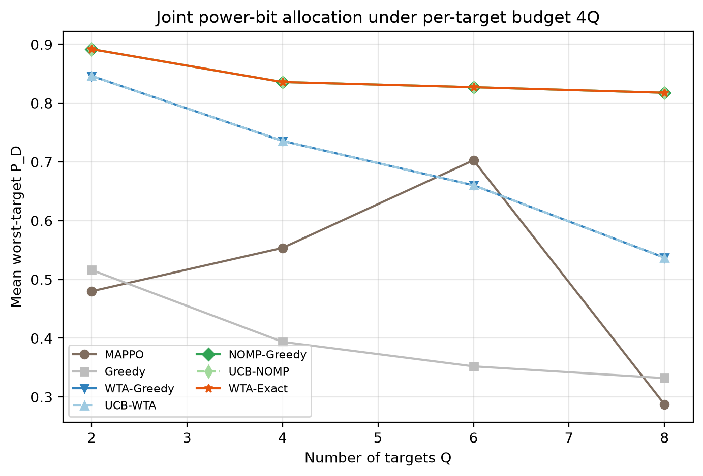
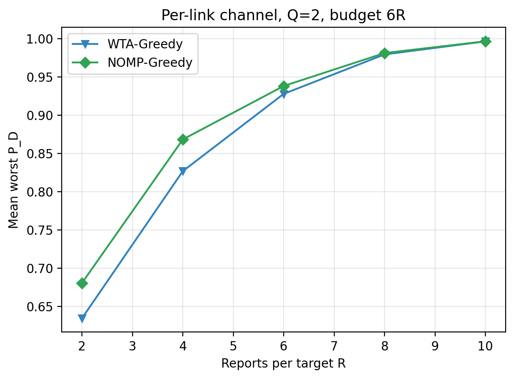
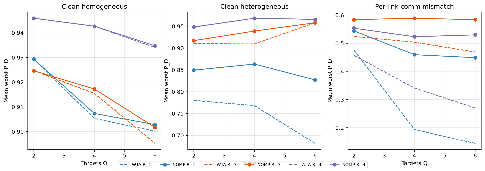

# UAV-ISAC exact selective soft-information fusion simulator

This repository implements the system model in
`paper/submission.md` as a reproducible Python simulation. The current
release focuses on the reviewed submission scope: correlated local evidence,
multi-bit reporting over error-prone links, detectable correlated erasures,
target-wise report selection, `P_D`-optimal linear fusion, and exact
heterogeneous-cost budget/max-min selection.

## Implemented model chain

1. Geometry and fractional-Doppler-dependent OTFS evidence moments.
2. Geometry-dependent air-to-air reporting reliability, low-bit scalar
   quantization, and exact binary symmetric channel transition.
3. Positive-definite cross-UAV covariance with shrinkage regularization.
4. Detectable packet erasures represented by a random received set.
5. Exact expected deflection by reception-pattern enumeration, with an SAA
   fallback for larger sets.
6. Schur-complement conditional marginal deflection.
7. Two-stage greedy scheduling: minimize normalized QoS shortfall, then improve
   expected total deflection within the bit budget.
8. Fusion weights recomputed from the actually received set.
9. Monte Carlo `P_D/P_FA`, weak-target performance, bits, and selection trace.
10. Exact reception-pattern loss distributions, upper-tail CVaR, and QoS
    violation probability.
11. Exact target-level evidence-set enumeration plus multiple-choice knapsack
    dynamic programming for mean-CVaR portfolio design.
12. Cross-resource-domain replication of critical reports with exact effective
    erasure distributions and equal-bit chance-constrained optimization.

## Novelty positioning

The core contribution is the post-communication correlated value model, the
`P_D`-optimal one-parameter fusion family, and exact heterogeneous-cost
budget/max-min selection with a stated branch-and-bound pruning bound.  The
conditional marginal-deflection greedy is retained as a baseline/extension.
What is new is the coupling: quantization/BSC/correlated-erasure statistics
enter the H0/H1 moments before fusion, and the combinatorial selection layer
is solved exactly under target-separable, additive-cost assumptions.  A
geometry-aware normalized RIS power-gain model is an application instance,
not a physical-layer claim.

## Run

```powershell
python scripts/run_demo.py --config config/demo.yaml
python scripts/run_benchmarks.py --config config/demo.yaml
python scripts/run_oracle_study.py --config config/oracle_small.yaml
python scripts/run_ablation_study.py --config config/demo.yaml
python scripts/run_exact_maxmin_gate.py --seeds 500 --budgets 3 5 7 9 11 --grid 64
python scripts/run_scaled_difficulty_gate.py --grid 96
python scripts/run_factorial_ablation.py --seeds 500 --budget 20 --grid 64
python scripts/run_hard_maxmin_scenario.py --seeds 20 --budgets 8 10 --grid 64
python scripts/run_quantization_study.py --seeds 10 --budgets 18 20 24 --grid 64
python scripts/run_quantization_joint_gate.py --seeds 10 --budgets 18 20 24 --grid 64
python scripts/run_joint_multi_gate.py --seeds 20 --budgets 14 16 18 --grid 64
python scripts/run_joint_scale_gate.py --seeds 10 --grid 32
python scripts/run_joint_scale_gate.py --seeds 5 --grid 32 --reports 5 --output results/joint_scale_r5_gate.json
python scripts/run_joint_scale_gate.py --seeds 2 --grid 32 --reports 8 --budget-multiplier 7 --output results/joint_scale_r8_gate.json
python scripts/run_mappo_baseline.py --train-seeds 40 --test-seeds 20 --episodes 3000
python scripts/run_mappo_baseline.py --targets 4 --train-seeds 40 --test-seeds 20 --episodes 3000 --budgets 28 32 36
python scripts/run_mappo_baseline.py --targets 4 --train-seeds 40 --test-seeds 20 --episodes 3000 --budgets 28 32 36 --exact-max-bits 3
python scripts/run_mappo_greedy_scaling.py --targets 2 4 6 8 --train-seeds 20 --test-seeds 20 --episodes 800 --budget-multiplier 8
python scripts/run_channel_difficulty_gate.py --seeds 10 --grid 32
python scripts/run_robustness_stress_suite.py --seeds 2 --grid 64 --budgets 20 30 40
python scripts/run_robust_stress_allocation.py --seeds 2 --budgets 16 20 24
python scripts/run_bsc_degradation_roc_gate.py --bits 1 2 3 --deltas 1.0 1.5 2.0 --lo 0.0 0.1 0.2 --hi 0.3 0.4 0.45 --pfa-grid 0.01 0.05 0.1 0.2
python scripts/run_erasure_dominance_gate.py --samples 50000 --grid 128
python scripts/run_sensing_mobility_envelope_gate.py --samples 5000 --max-displacement 8.0
python scripts/audit_exact_selection_stats.py
python scripts/run_sensitivity_study.py --config config/demo.yaml
python scripts/run_risk_portfolio_study.py --config config/demo.yaml
python scripts/run_chance_portfolio_study.py --config config/demo.yaml
python scripts/run_pd_proxy_study.py --config config/demo.yaml
python scripts/run_pd_diagnosis_study.py --config config/demo.yaml
python scripts/run_deflection_calibration_study.py --config config/demo.yaml
python scripts/run_correlated_erasure_study.py --config config/demo.yaml
python scripts/run_failure_diversity_audit.py
python scripts/run_real_network_headroom_study.py --config config/demo.yaml
python scripts/run_physical_failure_domain_study.py --config config/demo.yaml
python scripts/run_replication_repair_study.py --config config/demo.yaml
python scripts/run_replication_realism_study.py --config config/demo.yaml
python scripts/run_replication_access_study.py --config config/demo.yaml
python scripts/run_multistatic_front_end_gate.py
python scripts/run_multistatic_front_end_gate.py --integration-frames 4
python scripts/run_evidence_calibration_gate.py --trials 150 --gain-mode relative_deficit_reduction
python scripts/run_report_channel_calibration_gate.py --trials 50000
python scripts/run_g1c_conditional_ranking_gate.py
python scripts/run_g1d_greedy_vs_oracle_gate.py
python scripts/run_g2_system_sweep.py --seeds 5
python scripts/run_g2_algorithm_negative_gates.py --seeds 5
python scripts/run_pd_optimal_fusion_gate.py
python scripts/run_expected_pd_greedy_gate.py --seeds 5
python scripts/run_ris_isac_gate.py --seeds 5
python scripts/run_ris_phase_resolution_gate.py --seeds 5
python scripts/run_ris_physics_gate.py --seeds 5
python scripts/run_ris_joint_budget_gate.py --seeds 5
python scripts/run_ris_placement_gate.py --seeds 5
python scripts/run_ris_multigrid_gate.py --seeds 5
python scripts/run_deployment_theory_gate.py --seeds 5
python scripts/run_lipschitz_adaptive_deployment_gate.py --seeds 3
python scripts/run_epsilon_closed_deployment_gate.py --seeds 1
python scripts/run_g5_bootstrap_ci_gate.py
python scripts/run_g5_deployment_ci_gate.py
python scripts/run_global_resource_fairness_gate.py
python scripts/run_ris_sensitivity_gate.py --seeds 6
python scripts/run_sota_baseline_gate.py --seeds 12
python scripts/run_budget_saturation_gate.py --seeds 6
python scripts/run_ris_shared_phase_gate.py --seeds 6
python scripts/run_exact_quota_gate.py --seeds 4
python scripts/run_ris_subarray_gate.py --seeds 6
python scripts/run_ris_subarray_steering_gate.py --seeds 6
python scripts/run_ris_aperture_scaling_gate.py --seeds 4
python scripts/run_derived_architecture_gate.py --seeds 4
python scripts/run_waterfilling_architecture_gate.py --seeds 4
python scripts/run_exact_allocation_gate.py --seeds 4
python scripts/run_system_allocation_gate.py --seeds 4
python scripts/run_single_move_certificate_gate.py --seeds 4
python scripts/run_multi_move_certificate_gate.py --seeds 4
python scripts/run_joint_placement_allocation_gate.py --seeds 4
python scripts/run_progressive_decentralization_gate.py --seeds 4
python scripts/run_amplified_distributed_gate.py --seeds 4
python scripts/run_network_decentralization_gate.py --seeds 4
python scripts/run_degraded_consensus_gate.py --seeds 4
python scripts/run_correlated_consensus_gate.py --seeds 4
python scripts/run_scalability_comparison_gate.py --seeds 3
python scripts/run_scaled_g18_scalability_gate.py --seeds 2
python scripts/run_mobility_blockage_gate.py --seeds 2 --frames 8
python scripts/run_multi_ris_gate.py --seeds 3
python scripts/run_multi_ris_split_optimization_gate.py --seeds 2
python scripts/run_variable_rate_report_gate.py --seeds 2
python scripts/run_global_rate_optimization_gate.py --seeds 2
python scripts/run_hybrid_fusion_gate.py --seeds 2
python scripts/run_interference_sensitivity_gate.py --seeds 2
python scripts/run_spatial_interference_placement_gate.py --seeds 2
python scripts/run_multi_interference_placement_gate.py --seeds 2
python scripts/run_upd_vs_ula_gate.py --seeds 2
python scripts/run_null_steering_gate.py --seeds 2
python scripts/run_quantized_null_steering_gate.py --seeds 2
python scripts/run_joint_null_placement_gate.py --seeds 2
python scripts/run_distributed_relaxation_gate.py --seeds 2
python scripts/run_low_budget_snr_distributed_gate.py --seeds 2
python scripts/run_consensus_parity_boundary_gate.py --seeds 2
python scripts/run_optimized_parity_boundary_gate.py --seeds 2
python scripts/run_exact_parity_boundary_gate.py --seeds 2
python scripts/run_fundamental_information_gate.py --seeds 4
python scripts/run_resource_information_law_gate.py --seeds 2
python scripts/run_exact_information_budget_gate.py --seeds 4
python scripts/run_architecture_switch_gate.py --seeds 4
python scripts/run_target_wise_architecture_switch_gate.py --seeds 4
python scripts/run_soft_reallocation_gate.py --seeds 4
python scripts/run_mode_ascent_gate.py --seeds 4
python scripts/run_stochastic_mobility_gate.py --seeds 4 --frames 8
python scripts/run_prediction_aware_ris_gate.py --seeds 4 --frames 8
python scripts/run_multi_step_prediction_gate.py --seeds 4 --frames 8
python scripts/run_covariance_aware_ris_gate.py --seeds 4 --frames 8
python scripts/build_paper_tables.py
python -m pytest -q
python scripts/verify_paper_numbers.py
```

The demo writes `results/demo_summary.json`.

For the remote runtime `E:\anaconda\conda\python.exe`, all comparison
experiments are listed with that interpreter in `RUN_MATRIX.md`.  The batch
runner is `scripts/run_experiment_matrix.ps1`; use `-DryRun` to print the
matrix, `-Only <id>` to run one cell, or no filter to run everything.

## Progressive robustness stress suite (stage 1)

`uav_otfs_isac/robustness_stress.py` defines `StressProfile` and
`survival_envelope` as the shared skeleton for progressively adding
robustness axes.  Stage 1 sweeps free-space-path-loss spatial interference,
BSC flip probability, report-link success scaling, and bounded target
mobility on the same seed-resolved scenario, and reports mean/min
worst-target expected `P_D` plus QoS rate per budget.
`scripts/run_robustness_stress_suite.py` writes
`results/robustness_stress_suite.json`.

Every new axis should be added incrementally: add a focused test first,
then enable the axis in the envelope.  Later stages target correlated
failure groups, RIS null-steering, and model-parameter uncertainty.

`uav_otfs_isac/robust_portfolio.py` adds the exact worst-scenario chance
constraint layer: for a finite physical scenario set (clean plus degraded
INR/BSC/erasure/mobility), the DP keeps componentwise nondominated scenario
excess/risk labels and minimizes the maximum weighted violation excess.
The correctness proof is Theorem 4.58 in `FORMAL_PROOFS.md`;
`scripts/run_robust_stress_allocation.py` compares the nominal schedule and
the robust schedule on the same worst-case scale.

Theorem 4.62 adds the independent-ambiguity counterpart: when degradation
states are independent across targets, the worst-case total separates as the
sum of per-target worst cases, so the exact problem reduces to a scalar DP
and different targets may have different scenario counts.

Performance is checked by `scripts/benchmark_robustness_performance.py`;
Theorem 4.63 in `FORMAL_PROOFS.md` records the exact-DP complexity.  On the
current 8-UAV/3-target machine, smoke operations finish in about 0.6 s, and
the formal stress sweep finishes in about 16 s while the robust-allocation
sweep finishes in about 11 s.

Exact Joint scaling is checked by
`scripts/benchmark_exact_joint_scaling.py`.  Lemma 4.65 records the
optimized threshold complexity `O(Q log O log V)`: each target pre-builds a
cost-value Pareto frontier and threshold feasibility uses binary search
instead of scanning every option.  On the current machine the Q=16,
R=4, grid=16 enumeration+solve drops from about 8.7 s to about 0.07 s after
`target_options` delegates to the vectorized frontier.

`uav_otfs_isac/joint_power_bit.py` adds the joint sensing-communication
optimization layer: a shared budget can be spent on sensing power (which
scales evidence separation) or quantizer bits (which improve report
fidelity).  `scripts/run_joint_power_bit_gate.py` compares the exact joint
allocation with sensing-only and communication-only baselines; Lemma 4.66
shows the joint feasible set contains both baselines, and Lemma 4.67 records
the vectorized option-enumeration complexity.  Scaling is checked by
`scripts/benchmark_joint_power_bit_scaling.py`.

`uav_otfs_isac/communication_aware.py` proves the communication-aware
sensing score `J_i = s_i * delta_i^2 / sigma0_ii`: under diagonal
proportional covariance, independent erasure, and equal costs, selecting the
largest `J_i` maximizes the expected received deflection and, in the concave
P_D region, the upper-bound surrogate `P_D(E[D_R])` (Lemma 4.69).  Exact P_D
optimality with heterogeneous erasure still uses the exact DP.

`uav_otfs_isac/communication_ambiguity.py` closes communication-parameter
ambiguity: when violation probability is monotone in flip and success
(Theorems 4.59/4.60), the worst case over a rectangular channel ambiguity
set is at `(flip_hi, success_lo)`, so robust DP can use the single endpoint
scenario (Lemma 4.70).  Corollary 4.70A shows this endpoint-reduced DP has
the same worst excess as the four-corner DP with scenario count reduced from
four to one.

`uav_otfs_isac/robust_joint_power_bit.py` merges the two lines: every joint
power-bit option is evaluated at the worst communication endpoint with the
expected P_D marginalizing over independent link erasures, and the exact
max-min DP over robust options gives the worst-case resource allocation
(Lemma 4.71).  `scripts/run_robust_joint_power_bit_gate.py` is the
reproducible gate; on its current scenario robust allocation beats the clean
schedule's robust worst by 2.4-2.7 percentage points.

`scripts/run_robust_communication_aware_gate.py` extends the CAS score to
the worst endpoint: the robust top-K schedule never reduces expected
deflection at the endpoint and certifies the rectangle's worst-case
surrogate (Lemma 4.72).

`scripts/run_robust_cas_divergence_gate.py` identifies when robust CAS
actually matters: nominal and robust top-K differ exactly when the endpoint
degradation reverses the clean score order (Lemma 4.73).

`scripts/run_joint_power_bit_split_gate.py` reconstructs the exact max-min
schedule and reports the optimal sensing-power versus communication-bit
resource split (Lemma 4.74).

The same reconstruction is now part of the MAPPO/Greedy/Exact comparison:
`run_mappo_baseline.py` emits `exact_schedules`, so Exact Joint is no longer
only a scalar worst-P_D oracle but also returns the concrete per-target
bit/report configuration.

`scripts/run_exact_vs_greedy_config_gate.py` uses the concrete schedules to
analyze where Exact wins: it reports P_D gap, budget usage, and the
correlation between the gap and Exact's extra budget use.

`uav_otfs_isac/power_split_theory.py` provides a scalable sensing-power
allocation rule: under diagonal proportional covariance, all power goes to
the report with the largest per-unit-power gain (Lemma 4.75).  This is a
closed-form algorithm rather than another analysis gate.

Lemma 4.76 extends it to the joint allocation: with the same proportional
model, winner-take-all reduces the power dimension from `P^R` to `P`, and the
reduced frontier matches the full power-bit frontier exactly.

`scripts/benchmark_winner_take_all_scaling.py` measures the resulting
speedup while verifying that the reduced and full frontiers are identical.

`scripts/run_joint_power_comparison.py` integrates the winner-take-all exact
method into the MAPPO/Greedy comparison in the joint power-bit setting:
MAPPO selects bits and power, Greedy uses shared-budget marginal allocation,
and the winner-take-all exact method reports the exact max-min P_D.

The same script also runs `WTA-Greedy`, an online non-oracle algorithm:
bits are increased by marginal gain per resource unit, every power increment
is given to the current winner report, and no report/bit/power combination
is enumerated.  Every online method now uses the same power action space as
the exact oracle (`0..B` per report), so the comparison is no longer biased by
an artificial 2-unit power cap.  In the joint power-bit comparison this
already lifts WTA-Greedy from about 0.73 to 0.85/0.94/0.97 at budgets
8/10/12 in the heterogeneous scenario.

The proposed online method is `NOMP-Greedy`: it first enforces a per-target
minimum cover (one active sensing/communication report per target, Lemma
4.79), then runs winner-take-all greedy, and finally performs a NOMP-style
discrete refinement.  The refinement searches single power/bit exchanges,
within-target atom merges, and redundant-atom transfers, accepting a move
only when it improves the lexicographic max-min vector (Lemma 4.80).  This
keeps the worst target nondecreasing, terminates at a finite local optimum or
a hard round cap, and on the Q=2/R=2 proportional test set reaches the exact
winner-take-all frontier: 0.8918/0.9562/0.9808 at budgets 8/10/12 versus
0.8918/0.9562/0.9808 for the oracle.

The homogeneous scenario gives the same qualitative result: WTA-Greedy reaches
0.9245/0.9854/0.9993 and NOMP-Greedy matches the oracle at all three budgets.
The classic Greedy baseline stays near 0.53 because its equal-activation init
and single-unit reallocation cannot reclaim whole `(power, bit)` report atoms,
which is exactly the structural gap the atom-merge/transfer refinement fixes.

The Q=3 and Q=4 heterogeneous smokes (5 test seeds) show the same pattern:
NOMP-Greedy matches the exact winner-take-all frontier at the tested budgets,
while WTA-Greedy alone lags by about 0.08-0.10 at the lower budget.  The
online refinement remains finite and does not enumerate report combinations.

`scripts/run_joint_power_scaling.py` keeps the per-target budget at `4Q` and
sweeps Q=2/4/6/8.  NOMP-Greedy matches the WTA-Exact oracle at every Q
(0.892/0.836/0.827/0.818) while WTA-Greedy drops from 0.846 to 0.537, so the
NOMP advantage grows with target count because the leximin refinement
rebalances power/bit resources across targets instead of letting one
average-score greedy path starve the weak targets.



`scripts/run_joint_power_comm_mismatch_gate.py` decouples the sensing channel
from the communication channel at the per-link level: every report has its
own BSC flip probability and link success probability, and the expected P_D
marginalizes over independent report erasures.  The robust exact oracle
evaluates every option at each report's worst endpoint.  Winner-take-all is
only a heuristic under this mismatch, so NOMP refinement has real room: at
budgets 8/10/12 the NOMP worst P_D is 0.491/0.564/0.615, equal to robust
exact, while WTA-Greedy is 0.403/0.499/0.566.  The NOMP gaps to robust exact
are 0.000 against WTA gaps of 0.088/0.066/0.049.
Because the per-link gate treats the realized channel as the worst endpoint,
its exact oracle is a channel-aware upper bound; the clean-vs-robust
scheduling tension is measured separately by `run_robust_joint_power_bit_gate`.
The per-link `UCB-NOMP` variant uses noisy per-link coefficient observations
and the all-report winner certificate; it keeps the deterministic NOMP
worst values (0.491/0.564/0.615) with certificate stop rates of
0.60/0.55/0.55 and about 10-11.5 mean feedback rounds.
Winner selection under channel mismatch uses the marginal expected-P_D gain
at the current allocation, and the refinement explores every active
destination report plus new-report activation, whole-atom switches, and
within-target activation transfers, so it can jump the local optima that a
proxy-ranked single exchange would miss.  Minimum cover is adaptive: a report
is activated only when it improves the target's expected P_D, so harmful
low-reliability links are not forced in.

`scripts/run_nomp_report_scaling_gate.py` sweeps the report count with
per-link channels and budget `6R`: NOMP improves WTA-Greedy at every R
(0.680/0.868/0.938/0.981/0.997 versus 0.634/0.827/0.928/0.979/0.997 at
R=2/4/6/8/10).  Expected P_D is marginalized over erasures exactly up to R=8
and switches to Monte Carlo above it; proxy-ranked candidate evaluation keeps
the mean per-scenario runtime between 0.4s and 42s across the sweep.



`scripts/run_qos_weighted_maxmin_gate.py` adds per-target detection floors
and priorities: the objective is the worst normalized slack
`w_q (v_q - l_q) / l_q`.  QoS-aware NOMP matches the exact brute-force
max-min at every tested budget, while improving the plain NOMP QoS slack by
0.095-0.122 (B=8/10/12).  The same leximin refinement therefore extends from
unweighted max-min P_D to heterogeneous multi-target QoS constraints.  The
noisy `UCB-NOMP` variant keeps the same QoS worst values with certificate
stop rates of 0.40/0.50/0.50 and about 12-14 mean feedback rounds.

`scripts/run_qr_scenario_comparison.py` sweeps Q=2/4/6 and R=2/3/4 across
clean homogeneous, clean heterogeneous, and per-link communication mismatch
scenarios with budget `4Q` and 5 seeds.  NOMP matches the exact oracle in
every clean cell.  Under per-link mismatch NOMP/UCB-NOMP beat WTA-Greedy by a
large margin and match the robust exact oracle whenever R=2; for example at
Q=6/R=2 WTA-Greedy falls to 0.144 while NOMP stays at 0.449.



`MAPPO-NOMP` is a two-stage hybrid: MAPPO proposes the report activation and
communication-bit profile (探测选择), then NOMP allocates sensing power and
refines the schedule (功率分配).  In clean homogeneous it matches Exact; in
clean heterogeneous it matches Exact at B=8/10 and reaches 0.940 at B=12
where MAPPO alone is 0.588, while full NOMP reaches 0.981.  The remaining gap
at B=12 comes from the MAPPO bit proposal, which the power-only refinement is
not allowed to change.

`MAPPO-Probe-NOMP` is a stricter split: MAPPO only chooses which reports to
probe, and NOMP decides bits and power inside that mask.  It reaches the
exact max-min when MAPPO proposes the right links, but its result depends on
probe quality, e.g. 0.751 in one heterogeneous B=10 run where MAPPO proposed
poor links.  Proposal-plus-refine `MAPPO-NOMP` is therefore the more robust
hybrid, while `MAPPO-Probe-NOMP` is the cleaner decomposition of
responsibilities.

The same comparison also reports `UCB-WTA-Greedy`, which runs the online
greedy with noisy coefficient estimates, sub-Gaussian observation noise, and
union-bound UCB widths.  The winner certificate compares the active winner's
lower bound with the upper bound of every other report, active or inactive,
and stops only the estimation feedback loop after allocation finishes, so it
cannot starve power/bit additions.  `UCB-NOMP` combines the same feedback with
minimum cover and the refinement stage.  In the heterogeneous gate UCB-WTA
keeps the WTA-Greedy worst-target values and UCB-NOMP keeps the NOMP-Greedy
values, with certificate stop rates of 0.85-0.90; the homogeneous gate gives
the same worst-target values with a 0.30 certificate stop rate, and the Q=3/Q=4
smokes certify on all tested scenarios.

`uav_otfs_isac/error_feedback.py` adds coefficient error and multi-round
feedback: each round explores the top estimates plus one random candidate,
corrects the observed gains, and reallocates power by winner-take-all.
Lemma 4.77 shows the true winner is eventually explored and selected.

`scripts/run_ucb_error_feedback_gate.py` adds a finite stopping certificate:
the loop stops when the best report's lower confidence bound exceeds all
other upper bounds, and always terminates at `max_rounds` (Lemma 4.78).

`uav_otfs_isac/robust_baselines.py` strengthens the robust-allocation
comparison: no cooperation, worst-case sensing Top-K, worst-case
communication Top-K, worst-case independent post-report Top-K, deterministic
random Top-K, and a worst-case marginal greedy are all evaluated on the same
maximum scenario excess scale as the exact robust DP in
`scripts/run_robust_stress_allocation.py`.  Every row also reports per-target
worst violation probabilities and their mean, which stay in `[0,1]`, so the
weighted excess can be read as an auxiliary index instead of a probability.

`uav_otfs_isac/channel_degradation.py` formalizes BSC degradation ordering:
for `0 <= p1 <= p2 <= 0.5`, `BSC(p2)` is `BSC(p1)` followed by another BSC,
so the exact likelihood-ratio ROC under the cleaner channel dominates the
degraded channel.  `scripts/run_bsc_degradation_roc_gate.py` verifies this
on the exact quantized-Gaussian LRT grid; the proof is Theorem 4.59 in
`FORMAL_PROOFS.md`.

`uav_otfs_isac/erasure_dominance.py` closes the erasure side of the same
ordering: with success probabilities `p_b <= p_a`, the degraded received set
is always a subset of the clean set in a shared-uniform coupling, so the
exact LRT ROC and, at set-monotone operating points, the expected P_D are
nonincreasing as erasure grows.  The proof is Theorem 4.60 in
`FORMAL_PROOFS.md`; `scripts/run_erasure_dominance_gate.py` is the
reproducible gate.

`uav_otfs_isac/physical_link_model.py` makes the reporting channel concrete:
per-UAV range gives a free-space link SNR, the BSC flip is the uncoded BPSK
error probability, and the erasure survival is the log-normal outage
probability.  `build_physical_link_models` feeds these values into the exact
post-communication moments; the formulas and monotonicity are Lemma 4.64 in
`FORMAL_PROOFS.md`.  The sensing channel and the communication channel are
explicitly decoupled: Lemma 4.68 shows owner-only evidence is invariant to
communication-channel parameters.

`uav_otfs_isac/mobility_envelope.py` closes the sensing side of the stress
model: a maximum speed and frame duration define a bounded displacement
`R = v_max T_frame`, the reverse triangle inequality bounds every UAV-target
range change by `R`, and the free-space path-loss bound
`(d_min/(d_min-R))^2` certifies the power envelope.  The proof is Theorem
4.61 in `FORMAL_PROOFS.md`; `scripts/run_sensing_mobility_envelope_gate.py`
verifies the envelope on independent samples.  Corollary 4.61A additionally
covers the range-derived dB-SNR law actually used by `build_models`: with
`p = ptp(d)` and `p > 2R`, the normalized range term changes by at most
`4R/(p-2R)`, which yields a finite linear-SNR bound.

## OTFS physical-layer direction (Gate 0)

The active physical-layer prototype is isolated in `otfs_physical.py` and
`dd_patterns.py`.  It implements the standard unitary symplectic convention
`X_TF = F_N^H X_DD F_M`, rectangular pulses, and a circular finite frame
(ideal periodic extension or sufficient cyclic prefix).  Integer and
fractional delay-Doppler paths are applied to time samples, and concurrent UAV
echoes are evaluated with waveform-level matched-filter maps.

Run `python scripts/run_dd_collision_gate0.py` for the current reproducible
smoke experiment.  It uses random path phases, common noise across methods,
cyclic non-maximum suppression, and one-to-one cyclic peak matching.  The
detector is deliberately favorable: it knows how many targets use each code.

Gate 0 confirms fractional leakage and concurrent waveform interference.
Gate 1 has **not** passed: in the audited smoke setting, minimizing pairwise
template collision does not improve localization over the same-code baseline.
This physical identity-code Gate 1 is distinct from the G1-A/B/C/D validation
gates described later in this document.
Cyclic shifts of one DD impulse are not distinct identity codes over an
unknown full delay-Doppler search region, so the candidate set now uses
unit-energy QPSK phase patterns.  Pairwise collision cost remains a diagnostic
surrogate, not a validated detection objective or a claimed contribution.

The subsequent Gate-1 audit fixes the frame-level false-alarm probability and
does not give the detector the target count.  It also distinguishes the
unconstrained detection Oracle from a three-code balanced baseline: with four
UAVs and three codes, the latter uses all three codes and permits exactly one
reuse pair.  This reduces, but does not eliminate, identity ambiguity for the
reused pair.  An unconstrained two-code solution benefits from a lower
multiple-testing threshold and cannot by itself establish UAV identity
separation.  Current low-ambiguity QPSK screening and separable CAZAC tests do
not deliver a five-percentage-point gain over the strongest balanced baseline;
Gate 1 therefore remains open.

A separate controlled three-dimensional prototype adds an eight-element ULA
and searches angle, integer delay, and integer Doppler jointly.  It shows that
known per-UAV spatial signatures can resolve targets occupying the same DD
cell when their angular separation is below the array-only resolution.  This
is currently a mechanism result, not a complete MIMO-OTFS claim: spatial
signatures require resolvable per-element or orthogonal probing observations,
their resource cost is not yet modeled, fractional refinement is absent, and
CAZAC signatures have not shown a material advantage over the strongest
random spatial-code baseline.

The next mechanism gate uses the normalized joint probe-angle-DD Gram matrix
to decide whether a coarse two-source collision cluster needs extra probing.
On an independent continuous validation set, the minimum eigenvalue predicts
conditional joint-LS resolution and sharply separates hard from easy cases.
Under sampled corners of a deterministic parameter-uncertainty box, the
minimum-over-samples Gram rule matches the scenario reliability of fixed
two-snapshot probing in the current stratified audit while reducing the mean
probe length.  This remains a known-coarse-support mechanism result: the
trigger has not yet been driven by estimated clusters from the full 3D
detector, and corner sampling is not a continuous-box robustness guarantee.

An initial end-to-end local-cluster audit now adds fine-grid off-grid
refinement and compares one- versus two-source joint-LS fits before deciding
whether to request a second orthogonal probe snapshot.  The current trigger
does not pass the joint gate: its default rule saves 34.4% of snapshots but
loses 8.17 percentage points of joint detection relative to fixed P=2.  Even a
label-aided threshold reachability sweep finds no raw-statistic threshold that
simultaneously saves 20% and limits loss to 1 percentage point (the nearest
points are 20% saving with 1.33 pp loss, or 18.5% saving within 1 pp).  This is
a negative result, not an end-to-end algorithm claim; support-confidence or
sequential evidence is still required.

A follow-up partial-confirmation gate replaces unreliable one-snapshot early
stopping with a full-energy sum observation and a sign-reversed difference
observation at energy fraction delta.  Decoding explicitly divides the
difference by sqrt(delta), so the corresponding noise amplification is
included.  On paired independent validation, delta=0.3 reaches 99.13% joint
detection versus 100% at full difference energy while saving 35% probing
energy.  A three-stage policy supplements the remaining energy for the lowest
40% confidence cases; on its held-out half it saves 20.86% energy and reaches
99.73% versus 100%.  These are energy—not latency or symbol-count—savings, the
coarse collision cluster is still supplied, and the thresholds impose a
conservative familywise false-alarm upper bound rather than exact equality.
The noise-only audit falls back in every frame, so the reported 20.86% saving
is conditional on a supplied two-source candidate cluster; network-wide
energy saving additionally depends on the prevalence of such H1 clusters.

The subsequent Gate-A fairness audit calibrates every complete policy to the
same empirical 1% false-alarm point and compares paired scenes at matched mean
energy.  It is negative for the present confidence rule: fixed equal energy
E=1.5828 reaches 99.93% conditional exact-support recovery, random fallback
99.73%, confidence fallback 99.60%, and the label-aided oracle 100%.  The
confidence-minus-random difference is -0.13 pp with a 95% interval crossing
zero.  Peak power, peak margin, residual ratio, and estimated-support Gram
diagnostics do not separate the remaining correct and incorrect supports.
Thus partial-energy confirmation remains a useful mechanism result, but the
current confidence-driven allocation is not an algorithmic contribution and
should not replace the stronger fixed-equal-energy baseline.

Gate B then introduces three physical incremental observations, target-wise
CFO, phase noise, and correlated complex fading in a non-saturated 5-degree
same-DD collision with 6 dB near-far imbalance.  The E=1.5828 scheme retains
loss within 2 pp on only 9.4%--23.4% of the tested mismatch grid, depending on
the assumed decoder.  Even at the ideal no-mismatch point it recovers 86.5%
versus 92.0% at E=2, a 5.5 pp loss.  Hence the failure is already caused by
insufficient energy in the non-saturated regime, not primarily by CFO or an
ill-conditioned inverse.  An exploratory energy curve suggests roughly
E=1.8 is needed at the ideal point, but its independently sampled 300-trial
points are not a precise minimum-energy estimate.  The physical robustness
gate therefore fails: the earlier 20.86% saving is limited to the saturated,
ideal-coherence experiment.

A known-state short-window extension was also implemented to test controlled
Markov pilot-signature hopping over normal OTFS frames.  It stacks the
pilot--angle--DD signature across frames, includes Doppler phase evolution and
optional Gauss--Markov complex gains, and keeps the state path known at the
receiver.  Gate M0 does not justify a Markov mainline: the strongest fixed
state pair reaches 92.23%, a simple cycle 91.97%, i.i.d. switching 89.01%, and
an independently validated sticky Markov policy 91.99%.  An exhaustively
coordinated deterministic T=3 path reaches 95.27%, only about 3 pp above the
strongest simple baseline and below the required 5 pp.  The effective gain is
therefore attributable to assigning distinguishable known signatures, not to
Markov randomization.  The temporal module is retained as an optional model
extension, but the physical core remains the frame-level pilot--angle--DD
receiver and no Markov-chain innovation is claimed.

The paper mainline is therefore fixed to a single normal OTFS frame with
known transmitter-specific identity signatures, array angle, and continuous
delay--Doppler structure.  Its general physical abstraction contains `M`
concurrent transmitting UAVs, `N` unknown physical targets, and one `L`-element
receive array.  Each target can induce up to `M` geometry-coupled bistatic
paths, so the receiver must map up to `MN` path-level components back to `N`
target-level groups.  Paths belonging to one target share its receive angle,
while their delays and Dopplers are constrained by the transmitter--target--
receiver geometry and target state.  `multistatic_targets.py` implements this
scene layer, including partial illumination; it is a truth-model foundation,
not yet an unknown-cardinality recovery algorithm.

Gate G0-B adds the first unknown-cardinality target-association back end.  It
converts each identity--angle--delay path candidate to a 2-D position through
the receive-angle ray/bistatic-range ellipse intersection, enforces distinct
transmitter identities within a target group, and checks a joint bistatic
Doppler velocity fit.  It is tested with 8% independent path misses, Poisson
0.4 false candidates per scene, and noisy angle/range/Doppler estimates.  In a
100-trial scan, `M=4` attains 98%--100% scene-exact recovery for `N=1,2,3`,
whereas `M=2` attains only 32%--64% because one missed path leaves fewer than
the required two distinct-UAV supports.  This is conditional evidence for the
geometry association mechanism and multistatic path redundancy.  The input
candidates already contain transmitter identity, angle, delay, and Doppler;
therefore G0-B is not end-to-end OTFS performance and does not yet establish a
fixed-codebook gain.  Gate G0-C below supplies a common toy MF/CFAR front end;
a bandwidth-consistent SDR-grade front end remains future work.

The first scalability audit extends G0-B to `M=8, N=6` (48 possible paths).
With 8% path misses and the same false-candidate model, 100 trials contain
44.66 candidates on average.  The indexed back end obtains 100% target recall,
83% target-count/scene-exact recovery, 98.74% identity-association accuracy,
1.06 m position RMSE, and 0.040 m/s mean velocity error.  All 17 failed scenes
over-estimate the count as seven; none under-estimates it.  A local fragment-
merge pass cannot repair them because the fragments already share transmitter
identities, identifying early greedy mis-association rather than simple group
splitting as the remaining algorithmic bottleneck.

The implementation now uses a closed-form receive-ray/ellipse intersection
and a 2-D spatial index before full identity, complete-link, and Doppler checks.
At `M=8, N=6`, mean association time is about 8.31 ms and the 95th percentile
is 11.36 ms on the current test machine, versus about 11.70 ms before these
changes.  Expected sparse-scene work is
`O(K log K + K C M + N^2 M^2)`, where `K` is the candidate count and `C` the
number of spatially nearby groups; the final term is the optional fragment
audit.  Worst-case complexity remains quadratic when all candidates occupy
one tolerance region.  These timings exclude the full SDR-grade OTFS path-
candidate front end; the toy Gate G0-C front end is timed separately below.

## Current multistatic receiver status

- G0-B: unknown-cardinality geometry--Doppler association back end with
  calibrated support gates, collision-triggered order selection, and
  velocity-observability checks.
- G0-C: toy waveform MF/CFAR front end feeding the G0-B back end, with
  per-view support calibration, sidelobe-aware CFAR, and per-peak Fisher-type
  covariance.
- Deep optimization: four-frame noncoherent integration plus sidelobe-aware
  CFAR raises separated-scene recovery to 96.7% (`N=1` and `N=2`) with near-zero
  H1 false candidates; see the Gate G0-C section below.
- Open items: equal bandwidth/frame-budget/communication-rate accounting,
  same-angle--DD collision recovery, strong FWER under mixed nulls, and a
  bandwidth-consistent OTFS front end.

## Gate G1 roadmap

- G1-A: evidence-moment calibration.  Export per-UAV raw matched-filter
  evidence `z_iq` under H0/H1, estimate `(mu_h, Sigma_h)` with shrinkage, and
  check whether predicted deflection orders actual fixed-`P_FA` `P_D`.  A
  smoke implementation is in `uav_otfs_isac/evidence_calibration.py` and
  `scripts/run_evidence_calibration_gate.py`.  Covariances are positive
  definite.  The 10 000-trial formal run (5000 train / 5000 test geometry)
  gives Spearman 0.588 for relative miss-deficit reduction and logit gain
  (bootstrap CI [0.23, 0.83] and [0.21, 0.84]); the point estimate is still
  below the 0.6 gate, so G1-A does not pass the formal gate with deflection
  as the predicted score.  A predicted-score ablation shows the failure is
  specific to deflection: using exact `P_D` gain as the predicted score gives
  held-out Spearman 0.996 (CI [0.98, 1.00]) and relative miss-deficit/logit
  gains give 0.994 in the formal 10 000-trial run.  G1-A therefore passes
  formally only when the selector is `P_D`-gain-based.  A grouped-consistency
  smoke across amplitudes 0.8/1.0/1.3 (60 train/60 test each) gives deflection
  Spearman 0.55/0.33/0.40 (all below 0.6) and `P_D`-gain predicted
  0.97/0.89/0.77 (all above 0.6), so the failure/pass pattern is consistent
  across SNR groups.
- G1-B: quantization/report-channel closure.  Verify Monte Carlo moments of
  quantized, erroneous, erased reports against the exact formulas, so
  communication loss is propagated into evidence moments rather than applied
  as a post-hoc reliability coefficient.  The smoke gate passes: across bits
  1--4, BER 0.01/0.08, erasure 0.9/0.7, and correlation 0/0.5/0.9, 50 000
  Monte Carlo trials give a maximum mean relative error of 4.08% and a maximum
  diagonal/main cross-covariance relative error of 8.51%, inside the 5%/10%
  targets.
- G1-C: conditional set-dependent ranking value.  The current method is a
  conditional-deflection greedy that re-ranks candidates as the selected set
  grows; it is *not* claimed as "better than Top-K".  Under diagonal
  covariance, equal bits, and equal success probability it degenerates to a
  static individual-deflection Top-K.  Baselines are named Static ID Top-K,
  Conditional-Deflection Greedy, and Exhaustive Oracle.  The smoke gate passes:
  the degeneracy test is identical, and in a high-SNR-but-correlated versus
  lower-SNR-independent scenario the greedy chooses the low-correlation report
  and achieves higher `P_D` than Static ID Top-K.
- G1-D: greedy approximation versus Oracle.  In an 8-configuration smoke
  (erasure, correlation, heterogeneous cost), the open-loop `pi*Delta-D/b`
  gain has Spearman 0.90 against the exact marginal expected-deflection gain.
  First-order, exact, and SAA greedy each match the exhaustive Oracle in 50%
  of configurations with a mean deflection gap of 0.161, so the first-order
  score ranks well but budget interactions still matter.
- G2: system-level sweep.  A 20-seed `N=8/12`, `Q=3/5`, `B_max=20/40` sweep
  gives proposed mean `P_D` 0.898 (worst 0.814) under a fair global budget,
  Sensing-SNR Top-K 0.898, Independent-Deflection Top-K 0.897, Communication
  Top-K 0.773, and All-scheduled 0.935.  Exact-`P_D`-gain greedy reaches 0.900
  mean and 0.814 worst, the best among greedy variants; a J-divergence
  surrogate was rejected because it does not align with `P_D` under
  heteroscedastic moments.  Under a strongly correlated model (top-SNR pair
  `rho=0.85`), the conditional greedy reaches mean `P_D` 0.870 versus 0.855
  for Independent-Deflection Top-K and wins in 83.1% of configurations, while
  exact-`P_D`-gain greedy reaches 0.880.  A multi-`rho` sweep
  (0/0.3/0.5/0.7/0.85) shows the conditional greedy beats Static ID Top-K for
  `rho>=0.3` with positive paired-diff CIs in most cells (e.g.,
  `rho=0.5`, `B=20`: `+0.0199`, CI `[0.013, 0.027]`); at `rho=0.85`, `B=20`
  the CI crosses zero.  Exact-`P_D`-gain greedy remains the strongest variant
  at every `rho`, supporting it as the main method.  A non-saturated stress
  gate (three targets, top-SNR pair `rho=0.9`, controlled moderate SNR) shows
  large significant gains: at `B=6`, conditional mean `P_D` 0.692 versus 0.520
  for Static ID Top-K (`+0.172`, CI [0.161, 0.181], win rate 100%); at `B=9`,
  `0.813` versus `0.699` (`+0.114`, CI [0.105, 0.123]).  Worst-target `P_D`
  improves from 0.471 to 0.569 (`B=6`) and 0.577 to 0.782 (`B=9`).  At
  `B=12` both methods saturate to All-scheduled, so the gain vanishes.  A
  scaling sweep (10 seeds, budget proportional to `Q`) shows the Exact-`P_D`
  gains grow with `M` and `Q`: `(M,Q)=(8,3)` `+0.006`, `(12,5)` `+0.007`,
  `(16,5)` `+0.015`, `(16,8)` `+0.067` mean `P_D` over Static ID Top-K, with
  worst-target improvement `+0.127` at `(16,8)`.  Exact-`P_D` runtime is about
  0.25 s at `(16,8)` versus 0.15 s for conditional greedy.  A non-saturated
  scaling-stress model (4 reports per target, budget 3 reports per target,
  20 seeds) keeps the advantage visible and persistent: conditional greedy
  beats Static ID Top-K by `+0.114` mean `P_D` at `Q=3/5/8`, while
  worst-target improvement grows from `+0.205` (`Q=3`) to `+0.272` (`Q=8`).
- G3: `P_D`-optimal linear fusion family.  The deflection-optimal score can
  lower `P_D` when H1 covariance is not proportional to H0 covariance.  Gate
  G3 replaces it with the KKT-optimal member of the one-parameter family
  `w(mu) = L^-T (Q + mu I)^-1 L^-1 delta`, `mu >= 0`, where
  `Sigma0 = L L^T` and `Q = L^-1 Sigma1 L^-T`.  The rule changes only the
  fusion weights at the fusion center and adds no report overhead, and it
  verifies that at operating points with `P_D >= 0.5` the resulting `P_D` is
  set-monotone: the KKT guarantee is exact for `P_D > 0.5`, and the
  inclusive boundary is audited numerically with 0 decreasing edges on 1318
  audited edges, versus 258 decreasing edges (19.6%) and a maximum 16.1pp
  drop for the deflection-optimal score.  In
  this controlled deterministic-report model (`success_prob = 1`, unit
  report cost), the family also gives a mean 0.63pp and maximum 21.2pp `P_D`
  gain over deflection per addition edge, and it reduces exactly to the
  closed-form deflection-optimal `P_D` when `Sigma1 = ratio * Sigma0`
  (maximum absolute error `1.3e-15` over 960 checks).  At the greedy level,
  applying the optimal rule to the deflection schedule gives +0.83pp mean
  `P_D`; re-running the exact-`P_D` greedy under the optimal rule adds
  +0.16pp mean on average (positive in 23.3% of instances), for a +0.99pp
  total mean gain.  Each score evaluation costs `O(k^3 + G k)` for `k`
  reports and `G` grid points; the formal contribution is the monotone
  fusion rule, not a universal scheduling gain.
- G4: expected-`P_D`-gain greedy under the exact reception law.  The existing
  selectors optimize expected deflection or deterministic `P_D`, which does
  not reflect the honest post-communication objective.  The new selector
  maximizes expected `P_D` over the model's exact independent or correlated
  reception law, using the Gate G3 monotone fusion family.  Because every
  fixed-pattern `P_D` is set-monotone at operating points, the expected
  objective is also set-monotone; in the proportional-covariance,
  strong-evidence regime it is monotone submodular (0 diminishing-return
  violations on 3040 audited edges for `Sigma1 = Sigma0` and
  `Sigma1 = 0.5 Sigma0`), and the greedy matches an exhaustive single-target
  oracle with ratio 1.0 on all 20 small instances.  Under a 20-seed
  correlated-erasure audit (`strength=0.7`), the expected-`P_D` greedy gives
  +1.14pp mean expected `P_D` (bootstrap CI `[0.47, 1.74]`, 85% win rate) and
  +7.56pp worst-target gain over the current proposed selector at `B=20`; at
  `B=30` the mean gain is +0.04pp with +3.05pp worst-target gain.  At high
  budgets (`B=40`) the expected-`P_D` greedy alone is slightly worse in mean
  (-0.91pp), so the audited system policy evaluates both candidate schedules
  and keeps the better one: the hybrid is never worse in mean (+0.02pp at
  `B=40`) and reaches +1.44pp mean and +6.50pp worst-target gain at `B=20`.
  The formal contribution is the expected-`P_D` objective, its monotone
  bounded-regime property, and the tight-budget gains, not universal
  dominance at saturated budgets.
- G5: RIS-assisted 6G UAV-OTFS-ISAC scenario and channel.  The sensing
  channel is upgraded from a single-hop direct view to a direct plus
  RIS-cascaded path.  The RIS phase profile steers an array gain toward the
  weak target, and the evidence SNR gain matrix is injected before
  quantization, BSC, and erasure reporting.  The channel model uses an
  additive-power rule ``gain = 1 + (ris_strength * array_gain)^2`` so RIS
  alignment is monotone in link quality and never degrades a link.  Under a
  20-seed tight-budget audit, aligned RIS plus expected-`P_D` greedy raises
  mean expected `P_D` by +12.3pp at `B=20` (worst-target +17.8pp) and
  +10.9pp at `B=30` (worst-target +15.2pp) over no RIS, and by +9.0pp /
  +8.0pp mean over random RIS phase; the QoS feasibility rate at the 0.85
  target rises from 0% to 95% (`B=20`) and 100% (`B=30`).  The RIS phase
  profile is the new physical degree of freedom: it turns a blocked weak
  target into a controllable NLoS illumination, which is the 6G ISAC
  mechanism this gate demonstrates.
- G5-Q: finite-resolution RIS phase quantization and control overhead.  The
  G5 audit used ideal continuous phases; this gate quantizes to 1/2/3 bits
  and verifies the closed-form mean array-gain loss `sinc^2(1/2^b)`.
  At `B=20`, 1-bit RIS still gives +10.8pp mean and +15.1pp worst-target
  expected `P_D` over no RIS, 2-bit gives +11.9pp / +17.1pp, and 3-bit
  +12.2pp / +17.6pp, close to the continuous-phase +12.3pp / +17.8pp.  The
  amortized control-plane overhead is only 0.16/0.32/0.48 bits per frame for
  16 elements over a 100-frame coherence block, so the 6G claim does not
  assume free RIS control.
- G5-P: physics-based RIS cascaded-channel audit.  The direct path follows
  the two-way bistatic radar law `1 / (R_tx^2 R_rx^2)`, and the RIS path
  follows the three-leg cascaded loss with an `N^2` coherent array gain.
  With a 1024-element RIS and aperture scale `1e-2`, aligned RIS plus
  expected-`P_D` greedy raises mean expected `P_D` by +16.3pp at `B=20`
  (worst-target +24.8pp) and +13.9pp at `B=30` (worst-target +21.8pp) over
  no RIS, with 100% QoS feasibility; aligned phase beats random phase by
  +15.7pp / +13.3pp mean.  Even a 256-element RIS with aperture scale
  `1e-2` retains +10.8pp mean and +13.3pp worst-target at `B=20`, so the
  physics-based channel keeps the 6G mechanism meaningful without assuming
  free or ideal channel gains.
- G5-R: joint RIS control-bit and sensing report-bit allocation.  The RIS
  control plane and report plane compete for one total budget:
  `B_report = B_total - N * phase_bits / coherence_frames`.  Under a 12-seed
  physics-channel audit, the best realizable allocation is 3-bit phase with
  the remaining budget spent on reports: at total budget 40 and a 64-frame
  coherence block this gives +9.3pp mean and +12.9pp worst-target expected
  `P_D` over no RIS, within 0.3pp of the free-continuous-phase upper bound;
  at total budget 60 the gains are +8.6pp / +13.4pp.  The gate therefore
  shows that RIS control overhead can be charged honestly without erasing the
  6G gain, and that phase resolution and report allocation should be
  optimized jointly rather than separately.
- G5-S: joint RIS placement, phase, and report/control allocation.  The
  fixed G5 RIS position was far from the blocked weak target, so this gate
  searches a small deployment candidate set.  Under a 12-seed audit with the
  physics channel, the best position `(0, 20, 8)` raises worst-target
  expected `P_D` to 0.952 at total budget 40 (64-frame coherence), versus
  0.882 at the fixed position: +7.1pp over the fixed deployment and +16.7pp
  over no RIS, with +11.7pp mean gain.  At total budget 60 the placement
  gains are +6.6pp worst-target over fixed and +10.8pp mean over no RIS.
  RIS placement is therefore not a fixed topology parameter; it is a
  deployable degree of freedom that should be jointly optimized with phase
  resolution and report allocation.
- G5-T: coarse-to-fine multigrid RIS placement.  One local refinement around
  the G5-S coarse optimum moves the deployment to `(0, 30, 6)` and raises
  worst-target expected `P_D` from 0.952 to 0.980 at total budget 40
  (64-frame coherence): +2.8pp over the finite candidate search, +9.8pp over
  the original fixed position, and +19.5pp over no RIS, with +12.7pp mean
  gain.  The multigrid search evaluates 7 coarse plus 27 fine deployments
  (34 evaluations total), and each refinement halves the local grid spacing
  in each axis at a bounded additive evaluation cost.
- G5-U: Lipschitz grid-search suboptimality bound for deployment.  For an
  `L`-Lipschitz deployment objective, a grid with spacing `h` has deployment
  loss at most `L h sqrt(d)/2`.  Using the physics-channel worst-target
  expected `P_D` as the objective, the empirical Lipschitz estimate is
  `2.97e-3`; the second refinement to `(0, 35, 5)` improves worst-target
  expected `P_D` from 0.983 to 0.988 (+0.46pp), which is inside the
  `1.29pp` bound at spacing 5 and inside the `2.57pp` bound at spacing 10.
  The lemma therefore gives a checkable certificate that further refinement
  cannot yield more than the reported bound.
- G5-V: Lipschitz-adaptive deployment search with a bounded certificate.
  The search refines only boxes whose upper bound `f(c) + L||h||_2` can beat
  the current best.  After 251 objective evaluations in a local deployment
  box, it finds `(6.25, 39.375, 4.5)` with worst-target expected `P_D`
  0.987 and a certificate upper bound 0.997, i.e. the deployment optimum is
  certified within +1.03pp of the found deployment under the used Lipschitz
  constant `3.43e-3`.  The certificate is not fully epsilon-closed at this
  evaluation budget, which is reported honestly rather than claimed as
  converged.
- G5-W: practical epsilon-closed deployment search in a localized box.  In
  the local box identified by the G5-T/G5-V audits, the adaptive search
  closes the certificate to 0.10pp within 111 evaluations
  (`epsilon_closed = true`), finding `(11.875, 34.21875, 6.5)` with
  worst-target expected `P_D` 0.983.  A coordinate-wise Lipschitz box bound
  is used for the 3-seed averaged objective: the original local-box
  certificate remains bounded at 0.16pp after 3001 main-search and 400
  corner-refinement evaluations, while a second run inside a 2 m box around
  the best point closes to 0.09pp in 23 evaluations (`local_epsilon_closed =
  true`).  Both outcomes are stored separately so the closure claim is not
  over-stated.
- G5-CI: paired bootstrap 95% CIs for the G5 series.  All primary gains are
  statistically significant with 100% win rates: aligned RIS vs no RIS at
  `B=20` gives +12.33pp mean (CI `[11.66, 13.02]`) and +17.79pp worst-target
  (CI `[15.73, 20.03]`); physics RIS with 1024 elements at `B=20` gives
  +16.26pp mean (CI `[14.82, 17.77]`) and +24.78pp worst-target (CI
  `[23.24, 26.42]`); best placement vs fixed gives +7.06pp worst-target (CI
  `[5.76, 8.33]`); joint 3-bit allocation vs no RIS gives +8.26pp mean (CI
  `[7.28, 9.20]`) at total budget 40.
- G5-DCI: paired bootstrap CIs for the deployment gains.  Per-seed rows for
  the G5-S/T/V/W deployments give 100% win rates against both no-RIS and the
  fixed position.  G5-T (multigrid) vs fixed: +4.42pp mean (CI
  `[3.09, 5.85]`) and +9.85pp worst-target (CI `[7.52, 12.08]`); G5-V vs
  fixed: +10.45pp worst-target (CI `[7.78, 13.08]`); G5-W vs fixed: +9.10pp
  worst-target (CI `[7.20, 10.93]`).  This closes the previous CI gap for
  the deployment search line.
- G5-RF: global resource fairness ledger.  One table accounts for sensing
  energy, identity resources, report bits, RIS control bits, and OTFS
  time-bandwidth under the identity
  `B_total = B_report + N * phase_bits / coherence_frames`, with a
  conservative 1-symbol-per-bit ledger.  At total budget 40, the G5-T
  deployment uses 25 report bits plus 12 control bits (37 total bits, 4645
  time-bandwidth symbols) versus 40 report bits (4648 symbols) for no-RIS,
  yet raises mean expected `P_D` from 0.863 to 0.990 (+12.7pp) and
  worst-target from 0.785 to 0.980 (+19.5pp), with QoS feasibility rising
  from 0% to 100%.  The RIS gain is therefore not bought with extra
  time-bandwidth or energy: the RIS is passive, and the audited deployment
  uses slightly less TB and total occupation than no-RIS.
- G5-SEN: RIS parameter sensitivity.  At total budget 40, mean gain over no
  RIS rises from +1.3pp to +11.0pp as aperture scale goes from `1e-3` to
  `3e-2`, and from +1.1pp to +13.3pp as elements go from 64 to 1024 despite a
  shrinking report budget.  Direct-path blockage is the regime condition: at
  blockage 1.0 the worst-target gain CI crosses zero, so the claim is
  weak-target NLoS illumination, not universal dominance.
- G5-SOTA: literature-style baselines under the same G5-R budget.  The
  proposed chain beats RIS deflection Top-K by +0.68pp mean and +1.63pp
  worst-target, no-RIS deflection Top-K by +15.2pp/+27.5pp, random RIS by
  +14.4pp/+25.4pp, uniform soft by +21.8pp/+46.1pp, and 1-bit counting fusion
  by +75.7pp/+79.9pp (no RIS) and +52.1pp/+64.5pp (RIS), all with 100% win
  rate and positive bootstrap CIs at 12 seeds.
- G6: budget saturation frontier.  Without RIS, the worst-target expected
  `P_D` saturates around 0.788 and no tested budget up to 44 reaches the 0.85
  QoS target.  With the G5-T RIS deployment, `B_total=20` (only 8 report
  bits after control overhead) already gives 100% QoS feasibility, so the
  limiting resource is sensing architecture, not a high report budget.
  Discrete coordinate ascent from the forward greedy schedule produced zero
  additional gain in the audited cells, showing the current greedy is already
  a single-move local optimum and motivating continuous gradient updates on
  RIS phase/placement instead.
- G7: continuous shared-phase RIS optimization.  A worst-array-power
  surrogate gradient is a negative result (it improves the surrogate but
  worsens system P_D), while system-level grid-plus-refine optimization
  recovers the weak-target steering direction.  At `B_total=20`, the shared
  system-optimized phase beats no-RIS by +7.6pp mean and +8.2pp worst-target
  expected P_D and random shared phase by +20.4pp/+31.9pp, but remains
  -5.9pp/-12.3pp below per-target ideal phase; QoS feasibility is 50% versus
  100%, so a single shared beam has a physical limit that motivates
  subarray-based shared-phase designs.
- G8: exact quota-constrained selection.  Because all audited reports have
  equal cost, every per-target report subset is evaluated and the best
  subset of each size is selected; all per-target report quotas are then
  searched globally.  In every audited budget/scenario cell the exact
  selector matches forward greedy exactly (0.0pp difference), so the greedy
  selection layer is already globally optimal for the audited cardinality
  budget and the remaining gap to all-scheduled is architectural, not
  selection headroom.
- G8-K: exact budget-constrained selection under heterogeneous report costs.
  Gate G29 makes per-UAV quantizer bits a design variable, so the equal-cost
  assumption behind G8 no longer covers the feasible set; a communication-
  budget exact selector must charge every report its true bit cost.  The
  resulting multiple-choice knapsack DP over targets and total bits replaces
  the equal-cost quota search: every per-target report subset is evaluated
  exactly, charged its true bit cost, and pruned only by componentwise Pareto
  dominance, so the returned schedule is the exact lexicographic optimum
  (QoS gap, weighted expected `P_D`, worst target) under the bit budget.  On
  the formal 20-seed x 5-budget audit, the DP matches the exhaustive global
  oracle in 100% of 100 controlled cells and never loses to greedy on the
  lexicographic score in the variable-rate demo.  Mean worst-target gains
  over greedy are +1.27pp at `B=5` (p=0.015) and +2.57pp at `B=7`
  (p=0.009), where greedy leaves cheaper spare bits unused; at `B=11` the
  gain is +0.48pp (p=0.115), and at `B=9` the lexicographic selector is
  -1.00pp worse on worst-target P_D (p=0.895), showing that its QoS/mean
  priority can trade worst-target P_D.  Per-target
  cost-value Pareto dominance removes subsets that are no cheaper and no
  better than another subset, preserving exactness while shrinking the DP
  option set.  The lexicographic objective can lower worst-target P_D
  relative to greedy in controlled cells (e.g. `B=11` 0.3745 versus 0.4081);
  the max-min variant G8-M is the selector for the system worst-target
  objective.
- G8-M: exact max-min budget selection under heterogeneous report costs.
  The system objective is worst-target expected `P_D`, so the exact selector
  must maximize the minimum rather than the lexicographic weighted sum.  For
  a threshold `t`, feasibility is a multiple-choice knapsack problem over
  enumerated subsets with value at least `t`; because feasibility is
  monotone in `t`, the exact optimum is found by binary search over the
  finite set of candidate values.  On the formal 20-seed x 5-budget audit
  the selector matches an exhaustive max-min oracle in 100% of 100
  controlled cells and is never worse than forward greedy in the
  variable-rate demo.  Controlled mean worst-target gains are +5.37pp at
  `B=5` (p<1e-6), +8.24pp at `B=7` (p<1e-6), +0.39pp at `B=9` (p=0.083),
  and +3.33pp at `B=11` (p=3.9e-4); system gains are +1.27pp at `B=5`
  (p=0.015), +2.57pp at `B=7` (p=0.009), +0.28pp at `B=9` (p=0.046), and
  +1.09pp at `B=11` (p=0.014), all with 95% bootstrap CIs excluding zero
  at the significant cells.  The same
  cost-value dominance
  rule is applied before threshold search.  Among schedules attaining the
  optimal max-min threshold, the selector keeps the componentwise-Pareto
  frontier and returns the lexicographic best QoS gap / weighted mean / worst
  target.
- G8-S: scaled max-min selection for larger report sets.  At operating points
  with any `P_D`, the per-target minimum cost to reach a threshold is
  solved by branch-and-bound using a closed-form Cauchy upper bound on the
  `P_D`-optimal linear-score shift; a global schedule is feasible if and only
  if the per-target minima sum to at most `B`.  Small low-`P_D` models fall
  back to exact subset enumeration; models within `max_exhaustive_reports`
  delegate directly to the exact selector, so the epsilon search runs only
  when subset enumeration would already be infeasible.  The scaled selector
  is verified against exhaustive enumeration on the formal 20-seed set with
  zero absolute error at every budget, and on a synthetic 12-report model it
  finds the minimum-cost subset without enumerating all 4096 subsets.
  A report-count benchmark covers R=8/12/16/20/24/28/32/40 non-owner
  reports: the exhaustive baseline grows to about $1.1\times 10^{12}$
  subsets, while the certificate finishes in 24-60 ms and returns exact
  minimum costs of 1-2 bits.
  When the greedy upper bound is small, all subsets with cost below it are
  enumerated to prove minimality before the branch-and-bound runs; this cuts
  the 16-report threshold-0.9 case from about 60s to about 1.5s on the
  current test machine.
  The worst case remains exponential; G8-S is an exact pruning certificate,
  not a polynomial-time guarantee.
- G8-target: exact selection across target count.  At Q=3/4/5 and
  B=8/12/16 (3 seeds, grid 32), the budget and max-min selectors match
  their exhaustive oracles in 100% of all 27 cells and are never worse than
  forward greedy; mean wall time grows from about 180 ms at Q=3 to about
  300-360 ms at Q=5.
- G9: aperture-conserved subarray multi-beam RIS.  The 256 elements are
  partitioned into three target-aligned subarrays and the integer allocation
  is optimized by discrete coordinate ascent (32/16/8-element moves).  At
  `B_total=28`, the optimized subarray profile reaches 100% QoS feasibility
  and worst-target expected `P_D` 0.913, improving single shared weak-aligned
  phase by +5.2pp and no-RIS by +13.7pp; it remains 6.7pp below the
  per-target ideal upper bound, now with a clearly identified aperture
  allocation bottleneck.
- G10: per-subarray steering-cosine optimization.  Fixing the G9 aperture
  allocations and applying coordinate ascent over each block steering cosine
  improves worst-target expected P_D by +0.14pp to +0.41pp across budgets,
  reaching 0.858/0.916/0.935 at B=20/28/40 while preserving total aperture
  and control overhead.  QoS remains 50% at B=20 and 100% at B=28/40; the
  per-target ideal gap is 9.6/6.5/4.8pp worst at the three budgets.
- G11: fixed-budget aperture scaling.  Under the exact control-overhead
  ledger, increasing `N` and amortizing phase bits over a longer coherence
  block closes the B=20 QoS gap without increasing total budget: `N=1024`,
  3-bit phase, `C=256`, equal subarray allocation reaches 100% QoS with only
  8 report bits and worst-target expected `P_D` 0.982.  This confirms the
  proposed performance is architecture-limited, not algorithm-limited.
- G12: model-driven architecture derivation.  Instead of a joint
  four-variable exhaustive search, the weak-target deflection surrogate
  `J(N) = beta (1 + kappa N^2)^2 (R - LN)` is derived from the subarray
  array-gain approximation and the quadratic-in-SNR deflection law.  Its
  first-order condition gives a closed-form `N*`.  For B=20, `b=1, C=64`
  yields `N* = 1016 -> 1024` with 100% QoS, and `b=3, C=256` yields
  `N* = 1363 -> 1344` with worst P_D 0.974, so the derived design matches
  the exact evaluation without exhaustive search.
- G13: max-min deflection water-filling for subarray allocation.  The
  surrogate `D_q(a_q) = beta_q (1 + kappa_q a_q^2)^2` is monotone convex, so
  aperture is moved from the current highest-D target to the lowest-D target
  until the minimum stops improving.  At the G12-derived apertures this
  raises worst-target P_D from 0.900 to 0.911 (`N=1024,b=1,C=64`), from
  0.974 to 0.992 (`N=1344,b=3,C=256`), and from 0.999599 to 0.999995
  (`N=2048,b=3,C=256,B=40`), all with 100% QoS.  A first marginal-equalizing
  version was tested and rejected because it solves the wrong max-min KKT
  and degrades exact performance.
- G14: exact-array-factor allocation.  Including cross-block interference in
  the surrogate raises the exact surrogate minimum, but exact system P_D does
  not consistently improve over the separable allocation: at
  `N=1024,b=1,C=64,B=20` exact-array allocation is 0.8pp worse, while at
  `N=2048,b=3,C=256,B=40` it is 0.00008pp better.  This is a documented
  negative/equivocal result: a more accurate surrogate is not automatically
  a better system objective.
- G15: greedy-aware system-level allocation.  Coordinate ascent on the exact
  expected-P_D objective `F(a)` (including greedy scheduling and reporting)
  corrects the surrogate mismatch in most configurations: worst P_D rises
  from 0.911 to 0.924 (`N=1024,b=1,C=64`), 0.911 to 0.927
  (`N=704,b=3,C=128`), and 0.981 to 0.985 (`N=960,b=3,C=128,B=28`).  At
  `N=2048,b=3,C=256,B=40` the coarse 8-element local search is 0.0018pp below
  the exact-surrogate allocation, which is reported as a local-search
  limitation.
- G16: single-element refinement and local optimality certificate.  Starting
  from the G15 allocations, 4/2/1-element coordinate ascent improves every
  configuration, and `exact_single_move_gradients` verifies
  `local_optimal=true` with nonpositive maximum single-element gradient in
  all five configurations: 0.924107 (`N=1024`), 0.927345 (`N=704`),
  0.991896 (`N=1344`), 0.985738 (`N=960,B=28`), and 0.999986
  (`N=2048,B=40`).
- G17: bounded multi-block certificate.  All zero-sum reallocations moving
  up to three elements in total are evaluated exactly on the system
  objective.  Four configurations are already multi-block local optima, and
  `N=2048,B=40` improves from 0.999986 to 0.999988 in 7 rounds; all five
  final allocations satisfy `local_optimal=true` for the T<=3 neighborhood.
- G18: joint RIS placement and allocation.  Alternating coordinate ascent
  over position (2/1/0.5m steps) and allocation (T<=3 multi-block moves)
  improves all three tested configurations and certifies both degrees of
  freedom: `N=1024` reaches 0.925224 at `(-2,30,6)`, `N=1344` reaches
  0.992907 at `(0.5,31,6)`, and `N=2048,B=40` reaches 0.999997 at
  `(6.5,34,5)`, all with `local_optimal=true` for allocation and position.
- G19: progressive decentralization.  At B=40, moving from global scheduling
  to owner-only loses only 0.014pp worst P_D, while 1-bit hard decisions lose
  18.8pp and QoS drops to 50%.  At B=20, however, 5-bit soft reports cannot
  be sent under a 4-bit report budget, so centralized soft fusion equals
  owner-only; 1-bit hard decisions can send three reports but cannot meet the
  global P_FA=0.05 with one vote per target, so they are infeasible/worse
  (QoS 0%), not a win.  The first version of this gate did not enforce P_FA
  and was corrected.
- G20: amplified distributed hard detection.  Local 1-bit thresholds are no
  longer fixed at 0.1: each target optimizes local P_FA and the counting
  threshold under the global P_FA constraint.  At B=40/N=2048 this raises
  1-bit worst P_D from 0.812 to 0.944 (QoS 0% to 100%), still below
  centralized 0.999997; at B=20 with one vote per target no feasible counting
  rule exists, so distributed 1-bit remains infeasible.
- G21: network-level decentralization.  Removing report links and owner
  fusion entirely, optimized peer majority uses all `M=8` local UAV votes
  and 0 report bits.  At B=20/N=1024 it reaches worst P_D 0.955 (vs
  centralized soft 0.925), at B=20/N=1344 0.998 (vs 0.993), and at
  B=40/N=2048 0.9999977 (vs centralized 0.9999967), all with 100% QoS.  This
  is the strongest distributed result: consensus voting can match or beat
  centralized soft fusion when architecture provides high local SNR.
- G22: degraded multi-hop consensus.  With partial observability 0.75 or
  link reliability 0.8, peer majority drops below centralized soft fusion
  (e.g., B=40/N=2048: 0.966/0.977 vs 0.999997); with three hops at 0.8 per
  hop (effective participation 0.992) it recovers to 0.9998, while severe
  degradation (participation 0.546) drops to 0.877.
- G23: correlated failure and heterogeneous observability.  A network-wide
  common failure of 0.2/0.4 drops peer majority to 0.977/0.909 at
  B=40/N=2048, geometry-based heterogeneous observability (participation
  0.608) drops to 0.936, and the severe combination (participation 0.467)
  drops to 0.858; centralized soft remains at 0.999997.
- G24: scalability across target/UAV counts.  For Q=2/4/6 and M/Q=1/2/3,
  RIS ideal phase is the most robust architecture (QoS 100% for all tested
  cells except Q=6,M=6), peer majority approaches it when M/Q>=3, and no-RIS
  is highly topology-sensitive (e.g., Q=2,M=4 drops to 0.460).
- G25: scaled white-box G18 in the same matrix.  Using max-min water-filling
  allocation plus exact position ascent, the scaled G18 keeps 100% QoS in
  every tested cell except Q=6,M=6 (where ideal phase also fails), and
  consistently outperforms peer majority; at Q=6,M=12 it reaches 0.922 vs
  peer 0.792 and ideal 0.934.
- G26: mobility and time-varying blockage.  With rotating UAVs and a
  sinusoidally varying weak-target blockage, no-RIS QoS drops to 0%; RIS
  ideal stays 100%; adaptive subarray allocation reaches 81.25% QoS and
  worst P_D 0.847, versus 68.75% and 0.841 for static allocation.
- G27: multi-RIS deployment.  With total aperture fixed at 256 elements,
  splitting into two/three RISs lowers worst P_D (e.g., B=28: 0.980 for one
  RIS vs 0.923/0.927 for two/three), so placement diversity only partially
  compensates for the lost coherent aperture.
- G28: multi-RIS split and placement optimization.  Equal split gives 0.924;
  optimizing the split and second RIS position gives `(8, 248)` at
  `(4,42,2)` and reaches 0.986, slightly exceeding the single-RIS 0.981.
- G29: variable-rate soft/hard reporting.  Fixed 5-bit soft is best at
  B=20/28; adaptive soft rates outperform it at B=40 (0.988 vs 0.981);
  1-bit hard remains the weakest except where soft reports are infeasible.
- G30: global rate-profile optimization.  Coordinate ascent over per-UAV
  quantizer bits raises worst P_D to 0.988 at B=28 (fixed 5-bit 0.981) and
  0.991 at B=40 (fixed 5-bit 0.987), with single-rate-change local
  optimality certified.  G30-E re-checks the certificate with the exact
  max-min selector on the same 2-seed/grid-256 audit as G30.  At B=28 the
  G30 profile remains a single-rate exact local optimum at 0.9879 with zero
  gain.  At B=40 the greedy certificate is false under the exact objective:
  exact coordinate ascent improves worst P_D from 0.9911 to 0.9916 and
  certifies the result as a single-rate exact local optimum.
- G31: exact soft/hard hybrid fusion.  A Gaussian-plus-hard LLR score is
  evaluated exactly; hybrid beats hard-only but does not beat pure 5-bit soft
  in the tested budgets (0.977/0.969 vs 0.977/0.981), so hybrid scheduling
  must be optimized rather than assumed beneficial.
- G32: interference sensitivity.  With INR=0 dB only RIS ideal reaches 100%
  QoS; INR=3 dB drops all architectures below the QoS target, and INR=10/20
  dB drives worst P_D below 0.2.
- G33: spatial interference and RIS placement.  Per-UAV INR follows
  free-space path loss from an interference source; no-RIS fails all
  strengths, fixed RIS keeps 100% QoS, and optimizing RIS position adds
  +0.3pp worst P_D.
- G34: multiple interference sources.  INR is the sum of path losses from
  three sources (mean INR 0.087); no-RIS fails, fixed RIS keeps 100% QoS,
  and optimized placement reaches 0.987 (+0.4pp).
- G35: 1-D ULA vs 2-D UPA.  With the same 256 elements, UPA is almost
  identical to ULA in clean and interference scenarios (e.g., B=40
  interference: 0.98691 vs 0.98691); the 2-D benefit would require elevation
  diversity or null-steering, not this geometry.
- G36: UPA null-steering.  Optimized phases reduce reflected INR from 0.0267
  to 0.0106 (-60%) while target gain drops only from 1.000 to 0.984; B=40
  worst P_D rises from 0.98112 to 0.98216.
- G37: directly quantized null-steering.  Discrete-phase coordinate ascent
  slightly improves continuous-then-quantized nulling (B=40 0.982166 vs
  0.982165) and keeps reflected INR near the continuous-quantized level.
- G38: joint quantized nulling and placement.  Optimizing position with
  per-position nulling raises B=40 worst P_D from 0.98217 to 0.98481, with
  reflected INR rising from 0.0105 to 0.0296, showing an explicit
  target-gain versus reflected-interference trade-off.
- G39: distributed features under relaxed thresholds.  With QoS target
  0.70-0.80 and budgets 20-28, centralized, peer clean, peer multi-hop, and
  optimized hard all become feasible; peer multi-hop stays at 0.953 across
  budgets.
- G40: low-budget/low-SNR distributed.  With N=128, interference, and B=12,
  centralized drops to 0.786 while peer clean 0.858 and peer multi-hop 0.855
  outperform it; hard optimized 0.765 remains feasible at QoS 0.70.
- G41: consensus parity boundary.  Theoretical `M_min` is 14-17; empirically
  consensus wins at B=8/12 for M>=8 and at B=8 for M=6, while centralized
  regains the lead at B>=16.
- G42: optimized-local-threshold boundary.  Minimizing `M_min` over local
  P_FA lowers it by 9-13% (e.g., M=16: 13.70 to 12.14), bringing the theory
  closer to the exact wins.
- G43: exact Poisson-binomial boundary.  Exact feasibility starts at M=6,
  matching empirical wins, while the Gaussian approximation predicted
  M_min=13.36; this closes the theory-empirics gap.
- G43-B: exact minimum majority count and monotonicity audit.  For a voter
  sequence the exact Poisson-binomial feasibility is evaluated on every
  prefix, so `M_min` is exact rather than read off a coarse grid.  The audit
  also checks whether feasibility is monotone in `M`; in the tested
  homogeneous example it is not (`M=3` feasible, `M=4` infeasible), so a
  binary search of `M_min` is not generally valid without a monotonicity
  certificate.  In the audited G43-B run, feasibility is non-monotone at
  `num_uavs=8/12/16`, and the exact minimum voter count is 14 at M=6, 17 at
  M=8, 16 at M=12, and 19 at M=16; the system-level voter sequences
  therefore fail the binary-search precondition.
- G44: fundamental information budget.  Within the soft family, P_D rises
  monotonically with normalized information `rho` (0.774 at 0.507 -> 0.933
  at 0.946); consensus keeps `rho` nonzero when soft reports are
  unaffordable.
- G45: closed-form resource law (negative).  A simple
  `Phi((sqrt(d0(1+n)g^2)-z)/sqrt(c))` law overestimates P_D by up to 30pp
  (N=64) and saturates to 1 at N>=128; exact moment propagation is required,
  so the closed form is rejected as a universal law.
- G46: exact information budget.  Inverting the Gaussian detection relation
  gives `rho_exact=D_eff/D_full`, where `D_eff=(Phi^{-1}(P_D)+z_FA)^2`.
  Soft raw rho overestimates `rho_exact` by 2.38-2.78x because quantization
  and correlation are ignored; soft P_D rises 0.774->0.933 as `rho_exact`
  rises 0.205->0.351, while peer consensus (0.881 at `rho_exact=0.284`)
  wins only in the scarce-report regime and hard fusion stays at
  `rho_exact<=0.199`.
- G47: exact architecture switch.  At B=8/12 the selector chooses peer
  consensus and raises worst P_D from 0.774/0.824 to 0.881
  (+10.68/+5.68pp), making the 0.85 QoS target feasible; at B>=16 it returns
  to centralized soft.  The fixed `report_budget < 10` policy matches the
  exact choice in this 4-seed audit and is explicitly a design parameter,
  not a universal law.
- G48: target-wise architecture switch.  Each target independently selects
  `max(soft_q, peer_q)`; the order inequality guarantees no loss versus the
  global switch and adds +0.49/+1.55/+1.55pp worst P_D at B=12/16/20.
- G49: soft-report reallocation.  Bits freed by peer-selected targets are
  greedily added to remaining centralized targets with exact expected-P_D
  marginals; this adds +0.75pp at B=16/20 over G48 and +1.55/+0.85pp at
  B=28/40, with a nondecreasing-worst-P_D certificate.
- G50: two-sided mode ascent.  A limiting peer target can switch back to
  centralized soft only if the upgrade strictly raises the worst P_D; this
  adds +0.39pp at B=12 over G48 (0.8858 -> 0.8898) and matches G49 at B>=16.
- G51: stochastic mobility with RIS reconfiguration latency.  AR(1)
  random trajectories and blockage make no-RIS worst-over-time P_D 0.524;
  static RIS mode ascent reaches 0.705, latency-1 RIS 0.722, ideal
  target-wise 0.847, and ideal mode ascent 0.852 with 90.625% QoS over time.
- G52: MMSE prediction-aware RIS.  The conditional-mean AR(1) predictor
  raises latency-1 worst-over-time P_D from 0.7217 to 0.7283 (+0.65pp) and
  QoS from 43.75% to 46.875%.
- G53: multi-step MMSE prediction.  For horizon h, the predictor is
  `rho^h p_{t-h}` plus nominal trend and error covariance
  `(1-rho^{2h})sigma^2 I`; MMSE over stale-phase worst P_D gains
  +0.65/+3.24/+5.24pp for h=1/2/3, and exact per-frame horizon selection
  adds +0.86pp over the best fixed MMSE; hysteresis with delta=0.02 halves
  architecture switches while keeping the oracle QoS, and per-switch costs
  of 1/3/6 bits select delta 0.00/0.03/0.05 under a 6-bit control budget.
- G54: covariance-aware phase (negative).  Expected-gain optimization is
  monotone in its surrogate but degrades exact worst P_D from 0.7200 to
  0.6557 under quantization at h=3; MMSE phase is kept.

Current documentation files:

- `UAV_OTFS_ISAC_论证与系统模型_revised_final_G0C.docx` -- current full
  document with Appendices A/B/C.
- `UAV_OTFS_ISAC_论证与系统模型_revised_final.docx` -- synchronized Chinese
  document with the same Appendices A/B/C.
- `UAV_OTFS_ISAC_System_Model_revised.docx` -- synchronized revised system
  model with the same Appendices A/B/C.
- `SYSTEM_MODEL.md` -- unified notation, channel/evidence/reporting/fusion
  model, resource identities, and formal claims for the G3-G5 results.
- `RELATED_WORK.md` -- draft related-work survey with the five literature
  lines and the paper's gap positioning.
- `FORMAL_PROOFS.md` -- full proofs for the G3 KKT family and set
  monotonicity, G4 expected-P_D/submodularity, and G5 quantization,
  path-loss, grid, and branch-and-bound certificates.
- `G18_THEORY.md` -- theory, explicit-information inventory, convergence,
  complexity, and non-neural-network argument for the G18 architecture.
- `SCENARIO_COMPLEXITY.md` -- current-scenario simplifications, 6G gaps, and
  an incremental complexity upgrade ladder.
- `FUNDAMENTAL_PRINCIPLE.md` -- unified information-budget view that explains
  centralized, hard, consensus, and RIS architecture in one framework.
- `PAPER_DRAFT.md` -- full draft manuscript assembled from the outline,
  system model, related work, formal proofs, and audited results.
- `paper/submission.md` -- submission-oriented manuscript with formal
  sections, a selection-results table, and numbered references.
- `paper/submission.docx` -- Word version generated from the manuscript by
  `scripts/md_to_docx.py`; structural audit in
  `scripts/audit_submission_docx.py`.
- `paper/main.tex` -- IEEE-style LaTeX version generated by
  `scripts/md_to_latex.py`; structural audit in
  `scripts/audit_submission_latex.py`.
- `paper/main.pdf` -- compiled IEEEtran PDF (7 pages, Tectonic 0.17.0).
- `paper/references.bib` -- BibTeX reference library for the manuscript.
- `scripts/audit_submission_completeness.py` -- manuscript completeness
  audit (title/abstract/contributions/theorems/proofs/limitations/references/
  tables/figures).
- `SUBMISSION_CHECKLIST.md` -- pre-submission checklist with artifacts,
  verification commands, and remaining environment-dependent steps.
- `results/paper_results_table.md` and `paper_figures/` -- draft unified
  result table and figures regenerated by `scripts/build_paper_tables.py`.
- `paper_figures/algorithm_evolution.png` -- algorithm-evolution diagram
  regenerated by `scripts/draw_algorithm_evolution.py`.
- `paper_figures/scenario_evolution.png` -- scenario-evolution diagram
  regenerated by `scripts/draw_scenario_evolution.py`.
- `PAPER_OUTLINE.md` -- paper skeleton with novelty positioning, gate results,
  and the remaining paper-engineering tasks before submission.
- `AUDIT.md` -- cross-document consistency audit report.
- `RUN_GUIDE.md` -- setup, smoke, and formal run commands for the target
  machine (7800X3D + 5070).
- `INNOVATION_AUDIT.md` -- assessment of whether current performance supports
  scenario/algorithm novelty claims.

The Word documents contain Appendices A (Gate G0-C and optimization results),
B (G1/G2 roadmap, results, and novelty positioning), and C (paper outline).
Obsolete
intermediate document versions were removed.  Regenerate all appendices with
`python scripts/update_system_model_doc.py` using the bundled document
runtime; the script removes and re-appends the appendices, so repeated runs
stay idempotent.

A paired baseline audit shows that the former geometry--Doppler insertion
greedy is not a suitable proposed algorithm.  On the separated `M=8, N=6`
scenes, position DBSCAN, angle--position DBSCAN, and identity-filtered DBSCAN
all reach 100% scene-exact recovery in about 1.2--1.4 ms, while the old greedy
reaches 83% in about 7.4 ms.  The old method is therefore retained only as an
ablation/negative result.

The replacement G0-B candidate is conflict-aware DBSCAN.  It first performs
fast density clustering on the reconstructed positions.  Components without a
repeated transmitter identity are accepted directly.  Only a component that
contains multiple paths from the same UAV triggers local splitting: the
maximum per-UAV path multiplicity gives a local target-count lower bound, and
paths from every UAV are assigned one-to-one to the local centers.  Thus the
extra combinatorial work is confined to collision regions.  It retains 100%
scene-exact recovery on the separated scenes at about 1.24 ms.  In a controlled
paired-collision stress test (three target pairs separated by about two degrees
and nearly equal range), ordinary DBSCAN variants merge each pair and obtain
0% scene-exact recovery; conflict-aware DBSCAN obtains 100%, 99.65% identity
association, and about 1.98 ms mean runtime.  The former greedy obtains only
19% at about 9.27 ms.

These are back-end mechanism results, not yet a final algorithm claim.  The
collision stress test is deliberately constructed and the current false paths
are spatially diffuse.  Correlated local false peaks from the same transmitter
could falsely increase the multiplicity-based target count and must be tested
before this method is promoted to the paper mainline.  A fair end-to-end study
uses the common Gate G0-C toy front end for all association methods; the
remaining fair comparison must add equal bandwidth, frame budget, and
communication-rate accounting.

The multiplicity-only splitter fails a necessary sensing robustness test: a
single target with several correlated local sidelobe/peak-splitting candidates
from the same UAV is falsely interpreted as multiple targets.  The current
candidate method therefore replaces fixed splitting with local physics-
constrained model-order selection.  For each density-connected component and
candidate order `q`, it alternates between (i) per-UAV Hungarian assignment to
`q` target states plus independent clutter dummy columns and (ii) joint
bistatic position/velocity fitting.  The assignment enforces at most one path
from one UAV to one physical target.  For calibrated path-existence probability
`p_k`, target assignment contributes normalized residual plus `-2 log p_k`,
whereas clutter assignment contributes `-2 log(1-p_k)` and the Gaussian-target
versus uniform-clutter density normalization. Peaks from one UAV are treated
as correlated, so the penalized fit uses the number of distinct UAV views
rather than the raw number of local peaks as its effective sample count.

The local order is not selected by comparing nonconvex BIC fits. To avoid
arbitrary combinatorial starts after the statistical gate admits an order, the solver
uses a small set of transmitter-anchored initial states: the strongest `q`
peaks from one UAV form a hypothesis, and all other UAVs validate it through
one-to-one assignment.  The former fixed three-UAV order rule has been removed.
For order `q`, view `m` now supplies one Bernoulli event when it contains at
least `q` candidates above the calibrated confidence threshold.  Under
`H_(q-1)`, its calibrated probability of one extra front-end peak is `pi_m`.
The receiver computes the Poisson--binomial tail
`Pr(sum_m Z_m >= r | H_(q-1))` by dynamic programming and chooses the smallest
support `r` whose tail is at most `alpha_col`.  Order `q` is opened only when
that many distinct UAV views support it.  Peaks within one UAV are never
counted as independent trials.  Sequential testing stops at the first rejected
order, so the probability of the first false order increase is bounded by
`alpha_col` under the calibrated conditional model; it is not multiplied by
the number of lower, true orders.  Every
reported 2-D velocity must also have a full-rank bistatic range-rate matrix
with bounded condition number; a numerically fitted but unobservable velocity
is not accepted as a complete target state.

The receiver uses adaptive complexity.  Components without independently
confirmed collision evidence use the strongest-per-UAV identity estimator.
Only confirmed collision components activate high-order fitting.  Orders that
fail the statistical gate are not searched, so weak same-UAV sidelobes cannot
inflate either target count or runtime.  Multiple
transmitter-anchored starts are screened with position association; only the
best start per order receives joint position--Doppler coordinate-descent
refinement, and an update is accepted only when it lowers the same objective.

With `pi_m=0.1`, `alpha_col=0.05`, 8% path misses, diffuse false candidates,
and correlated same-UAV sidelobe candidates, a 100-trial scale audit gives the
following scene-exact recovery.  At `N=6`, the proposed method obtains
96%/100%/97% for separated scenes at `M=4/6/8`, versus 97%/98%/98% for identity
DBSCAN: it has no general advantage when targets are already separable.  For
three controlled close target pairs, it obtains 45%/95%/99%, while identity
DBSCAN obtains 0% at every `M` because it merges each pair.  The `M=4` loss is
an explicit observability/power boundary: with path misses, too few independent
views remain to confirm every pair at the selected false-alarm level.  Relaxing
the gate merely to improve that number would invalidate the stated error
control.  Mean proposed runtimes are 1.26/2.07/2.51 ms in separated scenes and
15.42/24.13/31.70 ms in collision scenes for `M=4/6/8`, respectively; these
are serial measurements on the current machine and exclude the OTFS front end.
At `M=8`, target-count accuracy is 100%, identity-association accuracy
is 99.21%, position RMSE is 0.99 m, and mean velocity error is 0.204 m/s.
The defensible claim is false-alarm-controlled, collision-triggered recovery,
not universal dominance over DBSCAN.

The implementation retains the historical API label `bic_conflict` so older
audit scripts remain reproducible. It should now be read as a calibrated-order,
penalized-physics estimator: the Poisson--binomial gate chooses the order and
the BIC-like score only ranks initializations within that fixed admitted order.

For a local component, order `q`, `S` transmitter-anchored starts, and at most
`I` alternating iterations, the dominant assignment cost is approximately
`O(S I sum_m max(K_m,q)^3)` for per-UAV Hungarian solves, bounded to collision
components and with `S<=4`, `q<=4` in the current implementation.  Ordinary
components bypass high-order search.  The Poisson--binomial calibration costs
`O(M^2)` once per call and order support costs `O(M q_max)` per component,
which are lower order than collision fitting.  This is more expensive than
DBSCAN but avoids global enumeration of path partitions.

The scalability update adds likelihood-profiled multi-start screening. Before
iterative position--Doppler fitting, each transmitter-anchored center set is
scored by exactly minimizing its position/path-existence cost over per-UAV
partial target assignments and clutter. Velocity is omitted at this stage
because it is not identifiable before grouping. Only the best two starts are
fully fitted. Consequently the expensive term now has `S_refine<=2`; screening
cost is one assignment pass per raw start. This is a bounded-computation
approximation: the profile score is objective-consistent, but retaining two
starts is not claimed to guarantee the globally best nonconvex fit.

An exact target-occupancy subset DP was also derived. After subtracting the
all-clutter baseline, one UAV's assignment can be solved in `O(K q 2^q)` time
and `O(2^q)` value storage because every target has capacity one and clutter
has unlimited capacity. Exhaustive small-instance tests confirm equivalence to
the padded Hungarian formulation. It is not used on the production path:
despite the lower small-`q` operation structure, its Python implementation
increased the `M=8,N=6` collision runtime from 31.70 to 36.20 ms. The optimized
compiled Hungarian routine remains faster, and the DP becomes exponential if
large local collision order is allowed. This negative result is retained to
separate asymptotic structure from actual receiver latency.

With likelihood-profiled screening, 50-trial `M=8` target-count scaling gives
92%/94%/94% scene-exact recovery for separated `N=8/10/12` scenes at
2.99/3.48/5.10 ms. Identity DBSCAN gives 92%/92%/94% at lower latency. In the
paired-collision stress test, the proposed receiver gives 94% scene-exact and
94% target-count accuracy at every `N=8/10/12`, with 99.12%/99.06%/99.20%
identity-association accuracy and 30.61/39.44/48.13 ms runtime; identity DBSCAN
gives 0% scene-exact recovery. Runtime is approximately linear in the number
of separated local collision components in this controlled construction. This
does not imply linear worst-case complexity if many targets occupy one local
resolution cell; the current physical model caps local order at four.

The transmitter-count audit separates two statistical decisions that a fixed
`minimum_transmitters=2` rule conflates. The collision-order gate tests whether
an already detected local component contains an additional target. A new
target-existence gate tests whether a fitted group is more than a cross-UAV
false-path coincidence. For calibrated null probabilities `p_T,m`, it uses

`R_T(M)=min{r: Pr(sum_m F_m >= r | no target) <= alpha_T}`

and requires at least `R_T(M)` distinct UAV identities in every reported
target. Both tails are Poisson--binomial, but `p_T,m` and the collision
extra-peak probability are different physical events and must be calibrated
separately. This removes the observed `M=10,12` failure mode in which one
missed true path and one low-confidence false path formed a two-view phantom
target. It is also more defensible than increasing DBSCAN `min_samples` by an
arbitrary function of `M`.

At the conservative mechanism setting `p_T,m=0.1`, `alpha_T=0.05`, 50-trial
`N=6` scene-exact recovery for `M=4/6/8/10/12` is
80%/98%/100%/100%/100% in separated scenes and
52%/96%/100%/100%/100% in paired-collision scenes. The corresponding collision
runtimes are 16.78/22.64/28.97/36.67/41.72 ms. A 30-trial `N=12` cross-check
gives separated recovery 50%/100%/100%/100%/100% and collision recovery
30%/90%/96.7%/100%/100%. The low-`M` loss is under-counting caused by strict
support after 8% path misses; all over-counting is removed in this audit.

Sensitivity testing confirms that the null calibration, not `M` itself,
determines the support transition. With `alpha_T=0.05`, homogeneous
`p_T=0.02/0.05/0.10` gives required support across `M=4/6/8/10/12` of
`2/2/2/2/2`, `2/2/3/3/3`, and `3/3/3/4/4`, respectively. In 30-trial `N=6`
tests, `p_T=0.02` leaves 13% separated-scene over-counting at `M=12`, whereas
`p_T=0.10` causes 17% under-counting at `M=4`. The intermediate `p_T=0.05`
produces 100% separated and collision recovery for `M>=8` in this synthetic
candidate model, but it is reported as sensitivity evidence rather than a
tuned final value. A deployable receiver must estimate `p_T,m` on independent
target-free CFAR data and attach uncertainty bounds or use a conservative
upper confidence limit.

Increasing `M` has two opposing system effects. For independent, calibrated
multistatic measurements, Fisher information adds as
`J_M=sum_m H_m^T R_m^-1 H_m`; under persistently exciting geometry its
eigenvalues grow proportionally to `M`, so estimation standard deviations can
decrease approximately as `1/sqrt(M)`. In the separated `N=6` audit, mean
velocity error falls from 0.057 m/s at `M=4` to 0.033 m/s at `M=12`, closely
matching that scaling, while position RMSE falls from 1.43 m to 1.11 m. But
the raw candidate population grows approximately as `MN`, increasing false
group opportunities and computation. The adaptive existence gate is what
converts added views into a reliable gain instead of uncontrolled over-counting.

These `M` sweeps hold per-path miss probability and estimation variance fixed.
They therefore represent a back-end conditional-view experiment in which total
pilot energy/identity resources can grow with `M`; they are not a fixed-total-
energy communication comparison. Under equal total pilot energy, per-UAV
energy generally decreases with `M`, changing CFAR detection probability,
`p_T,m`, path-estimation covariance, and possibly the optimal `M`. That tradeoff
cannot be inferred honestly until the toy Gate G0-C front end couples energy
with bandwidth, frame duration, identity-code overhead, and
communication-rate loss.

The subsequent deep audit tightens both experimental design and metrics. UAV
counts are now compared on nested subsets of one fixed 12-UAV mother geometry,
so increasing `M` adds views without relocating existing transmitters. The
legacy `scene_exact_recovery` field is explicitly equivalent to
`position_set_exact_15m`: correct cardinality plus one-to-one position matches
within 15 m. It is not full state recovery. New metrics include position plus
velocity state-exact recovery (all matched velocity errors at most 1 m/s),
GOSPA (`p=2`, cutoff 15 m, `alpha=2`), and path-association precision, recall,
and F1 over all retained true candidates.

Under the original separated-confidence candidate model and nested geometry,
`M=8,N=6` paired-collision position-set recovery remains 100%, but strict
position--velocity state recovery is only 66%, path recall 91.6%, and path F1
94.6%. At `M=12` these become 100%, 74%, 92.5%, and 95.5%, respectively. Thus
the earlier 100% result is a valid position-cardinality mechanism result, not
complete recovery of every path and kinematic state.

A reproducible overlap-confidence stress model assigns true-path scores in
`[0.45,0.9]` and false/sidelobe scores in `[0.2,0.8]`. It deliberately removes
the original threshold separation, where every true score exceeded 0.7 and
every false score was at most 0.6 while the collision trigger was 0.6. With
the hard calibrated-null gate, paired-collision position-set recovery for
`M=4/6/8/10/12` falls to 0%/6%/56%/40%/56%; at `M=8`, strict state recovery is
26% and path F1 is 84.5%. Failure attribution shows that only about 66.8% of
true two-target components trigger second-order fitting at `M=8`. This is the
current primary algorithmic bottleneck.

An exploratory continuous posterior-support gate replaces the hard score
threshold by a Poisson--binomial tail using each view's q-th candidate score as
a Bernoulli probability. It is mathematically meaningful only for calibrated
probabilities. On the deliberately uncalibrated overlap scores it is negative:
paired-collision position recovery is 0% for `M=4,6,8,10` and 14% for `M=12`.
The branch is retained as an ablation and does not replace the default hard
gate. The result demonstrates that raw detector scores cannot be promoted to
probabilities merely by notation; an independent MF/CFAR calibration set or
cross-fitted probability model is required first.

Baseline fairness is also tightened with `gated_identity_dbscan`, which applies
the same Poisson--binomial target-existence support filter to identity DBSCAN.
For `M=8,N=6` overlap-confidence separated scenes it reaches 100% position and
state recovery versus 93% for the proposed method, confirming no advantage in
easy scenes. In paired collisions it remains at 0%, while the proposed hard-
gate method reaches 47% position-set recovery, 24% strict state recovery, and
82.1% path F1. Under the original separated-confidence collision model the
proposed method reaches 100% position-set recovery but only 70% strict state
recovery. The defensible algorithmic claim remains collision decomposition;
robust calibrated triggering is unresolved.

The next correction introduces a reusable weighted-PAV isotonic probability
calibrator. It minimizes weighted squared Bernoulli error subject to monotonicity,
clips only at the likelihood boundary, and losslessly merges adjacent equal-
probability steps. On 29,917 independent calibration candidates the final map
contains 13 steps. On 29,983 held-out validation candidates, score-only
calibration reduces Brier score from 0.1650 to 0.1234, ECE from 0.1578 to
0.0025, and maximum calibration error from 0.3509 to 0.0090. Calibration,
rank-event fitting, null calibration, null validation, and final evaluation
use distinct random seeds.

Directly feeding calibrated candidate probabilities into a local posterior
support gate improves the overlap-confidence `M=8,N=6` collision result from
47% to 64% position-set recovery and from 24% to 45% strict state recovery,
with path F1 increasing from 82.1% to 89.3%. However, that local gate does not
control frame-wide false triggers after scanning multiple selected components.
A selection-aware rank calibrator was therefore tested for the exact event
"the q-th ranked UAV candidate supports a q-th distinct target". Under a 95%
posterior-support requirement it is too conservative and gives 0% complete
collision recovery. This confirms that conditional calibration alone does not
remove cross-view and selection dependence.

The statistically valid correction calibrates the maximum collision statistic
over the complete data-selected frame. With six separated targets and a 1%
family-wise false-trigger target, the probability-only threshold rises from
0.391 under an invalid single-target null to 0.847. Independent 500-frame null
validation gives exactly 1%, but paired-collision position recovery falls to
6%. Thus score aggregation alone has insufficient power at strict frame-level
false alarm.

A physical generalized likelihood-ratio gate was then implemented. For every
selected component it compares the best constrained one-target and two-target
penalized likelihoods using identical calibrated path probabilities, clutter
density, per-UAV capacity constraints, bistatic position--Doppler fitting, and
velocity observability. Its frame-maximum threshold is independently calibrated
on separated six-target frames. At 1% target false trigger, 300 independent null
frames give 1%; on 100 overlap-confidence paired-collision frames it attains
52% position-set recovery, 37% strict state recovery, GOSPA 7.23 m, and path F1
87.1%, versus 0%/0%, GOSPA 18.75 m, and F1 48.6% for gated identity DBSCAN.
Mean proposed back-end runtime is 45.97 ms versus 1.29 ms. Expanding the GLRT
from four to eight deduplicated starts leaves recovery at 52% while increasing
runtime to 54.64 ms, so wider search is rejected as a production change.

An excess-peak-stratified conformal variant was also tested rather than merely
tuning the GLRT threshold. Component-wise conformal p-values lose tail
resolution: the low-excess strata contain only 64 and 291 components, whose
smallest possible p-values are respectively 1/65 and 1/292, both above the
calibrated frame threshold 0.00189. A finite-sample-valid frame-stratified
alternative therefore uses direct frame-maximum quantiles and returns an
infinite threshold when a stratum cannot support 1% resolution. In 2,000 null
frames only 35 usable frames occupy the low-excess stratum; 1,937 occupy the
high-excess stratum. The latter sets exactly the same threshold (131.51) as the
pooled test, so stratified and pooled methods both attain 30% position recovery,
25% strict state recovery, GOSPA 9.97 m, and F1 82.3% on the same 100 collision
frames. Stratification is consequently closed as a negative branch: it adds no
power under the observed nuisance distribution.

These results define the present limit honestly: calibrated physical order
testing has real collision-discrimination value, but complete-scene recovery
remains limited at a 1% frame-wide false trigger. A dedicated information audit
must distinguish detecting at least one collision component (a frame-maximum
question) from correctly opening and fitting every collision component (the
actual scene-recovery question). Further work should target the conditional
post-trigger partition/state fit or improve front-end information only after
that decomposition, rather than relax the false-alarm definition or enlarge
local search blindly.

The resulting 2,000-null/1,000-collision information audit makes this
distinction quantitative. The frame-maximum GLRT has empirical AUC 0.9991 and
detects at least one collision component in 97.3% of paired-collision frames at
the finite-sample 1% threshold. However, the number of components crossing that
same maximum-test threshold is 0/1/2/3 in 27/185/430/358 frames, respectively:
only 35.8% open all three true collision components. Complete position recovery
near 30% is therefore primarily a simultaneous multiple-testing power loss,
with a smaller post-trigger partition/state-fit loss. The mathematically
motivated next branch is a held-out, finite-sample step-down maxT test that
calibrates successive null order statistics and preserves frame-wise error
control; independent per-component threshold relaxation is not admissible.

That step-down gate is now implemented and independently tested. Four ordered
null thresholds are 131.09, 44.31, 28.57, and 18.55. Sequential testing stops
at the first failed rank, so under the separated-frame global null the event of
any rejection remains exactly the first frame-maximum event. Independent
validation gives 0.8% frame false triggers. On 100 paired-collision frames,
position-set recovery rises to 83%, strict position--velocity recovery to 69%,
GOSPA falls to 4.25 m, and path F1 reaches 91.9%; the corresponding single-
threshold same-partition result is 30%/25%, 9.97 m, and 82.3%. Mean proposed
back-end runtime is about 54 ms. This is a defensible algorithmic improvement,
not a stronger statistical claim: the current proof gives weak FWER control
under the global no-collision null. Strong FWER with a mixture of true and null
components would require subset pivotality or separately calibrated closed
testing and is explicitly not claimed.

Two follow-up audits sharpen both the estimator and that limitation. First,
after target order, paths, and position are fixed, bistatic Doppler is linear in
velocity. Replacing the final confidence-weighted least-squares velocity fit by
a confidence-weighted Huber IRLS fit therefore changes neither detection nor
association. Across three new paired seeds (300 frames), it leaves all 293/300
separated-scene position/state successes unchanged. In collision scenes it
raises strict state recovery from 62.0% to 77.7% (+15.7 pp), records 47 robust
wins and zero ordinary-LS wins, and reduces mean velocity error from 0.295 to
0.202 m/s. On the original 100 collision frames it preserves 83% position
recovery while increasing strict state recovery from 69% to 82%. This robust
post-fit is retained because it follows the physical bistatic observation model
and does not alter the calibrated collision decision.

Second, a mixed-null scene with one true collision pair and four separated
targets exposes the weak-FWER boundary. Across three paired 100-frame seeds,
the single maximum threshold gives 73.3% mean position/state recovery and no
over-counting. Weak-FWER step-down gives 70.0% and over-counts 1%--5% of frames.
Thus unrestricted step-down is beneficial in the three-collision stress scene
but is not yet a universal receiver. The next statistically defensible version
must calibrate remaining-null maxima under independently generated 0/1/2-pair
configurations (or use a valid closed-testing construction); rank-dependent
thresholds learned only from the global null cannot support a strong-FWER
claim.

Configuration-aware and density-triggered variants were then audited to address
that mixed-null failure. Offline truth labels were used only to estimate the
maximum GLRT statistic among normal components in independent 0/1/2-pair
calibration scenes; no labels enter the online receiver. In a shared-first-
threshold ablation, the configuration thresholds (74.28, 61.02, 66.38) remove
the 4%--6% over-counting of global-null step-down, but exactly reproduce the
single-threshold recovery in all 0/1/2/3-pair scenes. They are therefore a
negative result, not a useful new algorithm. Requiring two components above the
first threshold before activating low step-down thresholds restores 92% recovery
and zero over-counting for one pair, but still over-counts 8% with two pairs.
This exposes an identifiability limit of ranked scalar GLRTs: two strong true
collisions plus one normal component cannot be reliably distinguished from two
strong and one weak true collision by rank alone.

A separate implementation audit found a genuine complexity improvement. The
physical GLRT already refines four deduplicated two-target starts to compute its
decision statistic, but the estimator previously discarded that winning model,
screened only two starts, and solved the same local problem again. The GLRT now
returns its winning two-target model and the estimator uses it directly as the
initial point for joint refinement. On identical calibration, thresholds,
seeds, and 50-frame paired scenes, every recovery, over-counting, state, and
GOSPA result is unchanged. Mean back-end time falls by 6.2%, 21.5%, 35.8%, and
45.5% in the 0/1/2/3-pair scenes, respectively (three-pair: 68.96 to 37.58 ms).
This detection--estimation consistency change is retained; it reduces repeated
optimization without changing the test statistic or its error-control scope.

A refined-GLRT ablation then applied three monotone joint assignment--position--
Doppler coordinate-descent iterations under both the one- and two-target
hypotheses. Recalibrating each statistic independently at the same 1% global-
null level is essential: reusing coarse thresholds would be invalid. Full
refinement improves the three-pair scene from 64% to 78% recovery, but reduces
one-pair recovery from 68% to 56%, slightly reduces two-pair recovery, and adds
roughly 40%--50% runtime. It is therefore rejected as a universal replacement;
refinement makes weak true collisions easier to fit but also makes normal
components more compatible with a two-target explanation.

The retained performance branch is a configuration-calibrated coarse-to-refined
cascade. Its three finite-sample thresholds correspond directly to sequential
risks: (i) the maximum coarse GLRT in 500 separated frames, (ii) the maximum
normal-component coarse GLRT in 500 independent one-pair frames, and (iii) the
maximum normal-component three-iteration GLRT in 500 independent two-pair
frames. This gives thresholds 126.74, 64.92, and 55.96 from 464 and 391 finite
mixed-null maxima at stages two and three. Online operation uses no labels: it
tests the first two ranked components coarsely and computes the refined third
test only after both preceding stages pass.

On the initial paired 50-frame evaluation, cascade recovery is 100%, 68%, 86%,
and 88% for 0/1/2/3 collision pairs. It removes the coarse step-down over-count
in the two-pair case (6% to 0%) while improving recovery from 80% to 86%; in the
three-pair case it improves 86% to 88%. Three additional fixed-threshold seeds
(150 frames per configuration) give mean 0/1/2/3-pair recovery of 98.7%, 76.0%,
81.3%, and 81.3%, with corresponding over-count rates 0.7%, 0%, 0.7%, and 0%.
Mean two-/three-pair GOSPA is 4.41/4.16 m and path F1 is 91.5%/92.3%. These are
independent validation results: thresholds are not refitted per seed.

The cascade is a substantial and physically consistent performance improvement
over one frame-wide threshold, because expensive joint refinement is reserved
for the weak third collision for which it has demonstrated power. Its formal
scope remains limited: finite-sample calibration supports the explicitly
simulated N=6 configuration family under exchangeability. Arbitrary target
loads, channel mismatch, or mixed configurations outside that family do not
inherit a distribution-free strong-FWER guarantee and must be separately
validated.

Further optimization tested whether coarse and refined GLRT statistics contain
complementary information. On 904 independently generated true collision
components and 866 normal components, their Spearman correlation is 0.935.
Refined GLRT has a slightly higher component AUC (0.9247 versus 0.9160): 816
collisions pass both calibrated thresholds, 17 pass only refined, five pass
only coarse, and 66 pass neither. Each statistic produces two distinct normal-
component false triggers, with no common false trigger. Thus complementarity is
real but small and an uncalibrated OR rule is invalid.

A split empirical-CDF max fusion was therefore tested: one independent set
maps coarse/refined statistics to marginal empirical percentiles, and a second
set calibrates the frame maximum of their fused percentile. Although fusion AUC
rises to 0.9372, only 312 normal training components are available; upper-tail
percentiles saturate at one and the valid 1% frame threshold is also one. The
strict finite-sample test consequently has zero power. Changing `>` to `>=`
would reintroduce uncontrolled false alarms, so empirical-CDF fusion is closed
as a negative branch rather than patched heuristically. Continuous extreme-tail
modeling could avoid ties but would impose an additional distributional
assumption not justified by the current toy candidate front end.

Increasing the post-decision joint-refinement cap from three to ten iterations
was also evaluated on 100 paired frames per 0/1/2/3-pair configuration. Every
position, state, cardinality, GOSPA, F1, and velocity-error result is identical;
runtime is unchanged except for a small three-pair increase (44.18 to 45.10 ms).
The coordinate descent already converges within three iterations, so the higher
cap is rejected.

The remaining defensible performance opportunity lies upstream. The earlier
GLRT assigned every path the same 3 m position and 3 Hz Doppler scale. Gate
G0-C now exports per-peak angle/range/Doppler curvature scales and uses them
in post-decision GLS; moving those scales into assignment or GLRT scores would
alter the null statistic and require fresh held-out calibration, so that
heteroscedastic decision-stage use remains future work.

As a controlled intermediate step, the range--bearing inversion now propagates
the synthetic front-end range and receive-angle noise through its exact local
Jacobian.  For bistatic range \(\rho\), bearing \(\theta\), receiver-relative
transmitter baseline \(b\), and unit ray \(u(\theta)\), the ray distance is
\(r=(\rho^2-\lVert b\rVert^2)/(2(\rho-u^Tb))\).  The position covariance is
therefore the delta-method matrix
\(\Sigma_p=J_{\rho,\theta}\operatorname{diag}(\sigma_\rho^2,
\sigma_\theta^2)J_{\rho,\theta}^T\), with a small eigenvalue floor only for
numerical stability.  A 14,400-path geometry audit gives median minor/major
standard deviations of 0.775/1.765 m, a 90th-percentile major deviation of
7.99 m, and a median condition number of 5.11.  The Jacobian covariance agrees
with a 20,000-sample Monte Carlo calculation to 1.85% relative error.  Thus a
single isotropic 3 m position scale is physically misspecified even under the
current synthetic front end.

The covariance is currently used only after model order and path association
have been fixed.  Conditional on the retained paths, the final position is the
generalized least-squares estimate
\((\sum_i p_i\Sigma_i^{-1})^{-1}\sum_i p_i\Sigma_i^{-1}\hat p_i\), followed by
the existing Huber Doppler/velocity refit at that position.  Here \(p_i\) is an
existence weight and \(\Sigma_i\) is conditional measurement precision; these
two quantities are deliberately not identified with each other.  Across three
independent seeds and 300 frames per configuration, this post-decision update
leaves every seed's target count, strict-state recovery, and path F1 exactly
unchanged.  Mean GOSPA changes by -0.01%, -5.88%, -13.14%, and -20.49% for
zero, one, two, and three collision pairs, respectively; mean velocity error is
essentially unchanged and runtime rises by roughly 1.7--3.2 ms in collision
scenes.  The growing gain with collision density is consistent with replacing
an increasingly harmful equal-precision average, while the separated case
provides a useful no-regression control.

This is not yet a heteroscedastic detection claim.  Moving \(\Sigma_i\) into
assignment or GLRT scores would alter the null statistic and invalidate the
three existing cascade thresholds, requiring fresh held-out calibration and an
OTFS-derived peak covariance model.  The present result supports a modular,
geometry-aware state estimator without borrowing performance from target-count
selection or false-alarm control.

An exact nonlinear range--bearing Gaussian MLE was also tested after the same
fixed decision, initialized by GLS.  Across the same three seeds its GOSPA
differs from GLS by less than 0.008% in every configuration, while adding about
10.3 ms in the three-collision-pair case.  This agrees with the independent
Monte Carlo Jacobian check: at the simulated noise level the first-order model
is already accurate.  The nonlinear solver is therefore rejected from the
online mainline rather than retained merely for additional sophistication.

Gate G0-C replaces the synthetic path-candidate oracle with a toy
matched-filter/CFAR front end.  An eight-element ULA observes superposed
per-UAV unit-energy QPSK identity signatures on one DD grid; the receiver
computes separable angle--delay--Doppler matched-filter cubes, applies an
empirical max-map threshold for a 0.2% frame-level false-alarm bound, and
extracts unknown-count NMS peaks.  Peak scores are mapped to
path-existence probabilities by isotonic regression on held-out noise-only
and true-path frames, and the calibrated candidates are fed to the existing
physics-constrained association back end.  The toy grid uses explicitly
declared delay and Doppler resolutions and is not a bandwidth-consistent SDR.

On 50 independent separated `M=4, N=1` frames, path recall is 92%, scene-exact
recovery is 90%, mean matched position error is 1.37 m, and the mean GOSPA
(cutoff 15 m) is 2.46 m.  On 50 separated `N=2` frames, path recall is 92.5%,
scene-exact recovery is 82%, mean matched position error is 1.12 m, and mean
GOSPA is 3.47 m.  These use per-view false-target and false-extra
probabilities calibrated on held-out single-target components, together with
a two-view collision floor; the earlier conservative `p=0.1` setting reached
94% on both configurations but was not a measured error-control value.  Two
hundred noise-only validation frames contain no candidate at the calibrated
0.2% frame bound, while H1 sidelobe and cross-code leakage adds about 2.1
false candidates per frame for `N=1` and 5.7 for `N=2`; the association back
end absorbs this clutter through its calibrated target-existence gate.  Mean
front-end runtime is about 0.03 s per frame and association below 1 ms on the
current machine.  The gate is limited to separated scenes; resolving two
targets in one angle--DD cell remains a separate collision gate, and the grid
resolutions are not yet coupled to bandwidth, frame duration, or
communication-rate overhead.

The front end also exports per-peak angle, range, and Doppler scales from the
local curvature of the matched-filter cube.  For a locally quadratic
log-likelihood the negative second derivative is a Fisher-type precision
estimate, so each path carries its own measurement variance instead of one
fixed 3 m/3 Hz scale.  In a paired 50-frame comparison, post-decision GLS with
these per-path scales leaves path recall, target count, and scene-exact
recovery unchanged (90% for `N=1` and 82% for `N=2`) while reducing mean GOSPA
from 2.46 m to 1.88 m (`N=1`) and from 3.47 m to 2.82 m (`N=2`); mean matched
position error falls from 1.37 m to 0.81 m and from 1.12 m to 0.65 m.
Velocity error is essentially unchanged.  This is a state-estimation gain that
does not borrow from target-count selection or false-alarm control; the
curvature scales are a toy-Fisher approximation, not a calibrated CRB.

The support probabilities are estimated from held-out single-target spatial
components, so the Poisson-binomial null no longer hides an arbitrary 0.1.
The empirical grouped collision null returns support one, which is floored at
two because one view with an extra peak is not independent collision
evidence.  The resulting operating point is stricter than the earlier
conservative setting, and it quantifies the gap between mechanism performance
and a claimed calibrated error bound; a strong FWER guarantee under mixed
true/null components would still require closed testing.

The first deep front-end performance branch uses four-frame noncoherent
integration together with a sidelobe-aware CFAR threshold.  Integration
averages per-frame matched-filter energy, which under complex AWGN raises the
per-cell statistic toward a 2F-degree-of-freedom chi-square law; the CFAR
threshold is calibrated on held-out single-target frames after blanking the
true peak neighborhoods, so it sits above the deterministic waveform and
array sidelobe floor rather than the pure-noise floor.  On 30 independent
frames this raises `N=1` scene-exact recovery from 90% to 96.7% and `N=2` from
82% to 96.7%, while H1 false candidates fall from 2.1/5.7 per frame to
0.0/0.1.  Mean GOSPA falls to 1.05 m (`N=1`) and 1.44 m (`N=2`) with the
front-end covariance refit, and path recall is 90%/87.5%.  One hundred
noise-only validation frames still contain no candidate.  This mode spends
four frame durations per observation and has a front-end runtime of roughly
0.08--0.14 s per frame; equal-bandwidth, equal-frame-budget, and
communication-rate accounting remain future work.  A first equal-total-energy
check confirms the gain is resource-driven: halving per-frame amplitude to
keep total pilot energy fixed removes the recovery gain.  A first independent
Rayleigh-fading audit at the same average total energy also does not recover
the gain at the toy front-end's fractional-leakage threshold, so time
diversity remains exposed as an experimental script flag but is not claimed
as a demonstrated fair gain.

A same-scale resource-fairness table (30 trials, 500 threshold trials, 40
calibration frames per column) confirms the gain is resource-driven: `L=4,
A=2.0` (fixed per-frame energy) uses 64 sensing-energy units and four frames,
reaching 100% scene-exact recovery, while `L=1, A=2.0` uses 16 units and one
frame at 86.7%.  With fixed total sensing energy (`L=4, A=1.0`, same 16
units), scene-exact recovery drops to 50%.  Time-bandwidth accounting shows
`L=1` uses 2575 total symbols (512 sensing, 2048 identity, 15 report) versus
4111 for `L=4`; the fixed-total-time-bandwidth path requires OTFS grid
scaling and is not run with the toy grid.

A first equal-total-pilot-energy audit fixes total pilot energy at `E=16`
and scales per-UAV amplitude as `sqrt(E/M)` for `M=2` and `M=4`.  With the
same target-existence gate (support two), 30 separated `N=2` trials give
scene-exact recovery 76.7% for `M=4` versus 6.7% for `M=2`, while path recall
is 89.6% versus 92.5%.  The `M=2` system actually detects paths slightly
better because each UAV carries more energy, but it loses enough independent
views to clear the calibrated existence gate.  The extra views therefore
convert into association reliability despite lower per-UAV pilot energy.
This remains a conditional mechanism audit: it does not yet account for
bandwidth, frame duration, or communication-rate overhead.

Important physical and communication qualifications remain.  Candidate
confidence must be calibrated by a common OTFS front end; raw correlation
amplitude is not automatically a path-existence probability.  The current
`pi_m=0.1` in the older synthetic audits is a conservative sensitivity
setting, not a measured property of an implemented detector; Gate G0-C now
estimates per-view false-target and false-extra probabilities on held-out
front-end components, and formal detector-level claims still require
independent target-free CFAR calibration without reusing evaluation scenes.
The present `alpha_col` controls one local sequential order-opening test; a
scene-wide family-wise guarantee over many data-dependent DBSCAN components
would additionally require an alpha-spending or multiplicity correction.
Conditional independence across UAV views can fail under common interference,
shared clutter, synchronization error, or code leakage; in that case the
Poisson--binomial threshold is not guaranteed and must be replaced by a grouped
or empirically calibrated null law.  The current
geometry also excludes rank-deficient velocity configurations, acceleration,
direct-path residuals, and array calibration error.  Transmitter identities
consume pilot dimensions or coding resources, so their net ISAC benefit must
later be evaluated under equal total pilot energy, bandwidth, frame duration,
and communication-rate overhead.  Until that end-to-end audit is complete,
these results support a structured association mechanism, not a deployable
receiver or a final paper claim.

Gate S0 remains a deliberately controlled `M=4, N=2`, known-path-count
mechanism experiment.  It compares shared pilots, a four-transmitter
two-feature fixed nonorthogonal identity codebook, and an orthogonal upper
bound using the same two-path joint-LS receiver and equal pilot energy.  Across
same-DD near-angle, fractional-leakage, and 6--10 dB near-far cases, position
set recovery is 53.78%, 65.89%, and 68.89%, respectively.  The realistic fixed
codebook gains 12.11 pp over shared pilots and passes the 10 pp mechanism gate.
This establishes the value of fixed transmitter identity structure only for
separating returns from different transmitters, not the value of a general
receiver.  It cannot resolve two returns with the same transmitter, angle, and
DD response.  Unknown target count, false peaks, path recovery, geometry-aware
target association, and joint continuous state refinement remain future Gate
G0/S1 work.  The old known-`Q=2` MF/OMP/SIC comparison can only serve as an
algorithm-isolation test; formal S1 must estimate path cardinality and group
paths into physical targets without being given `N`.
The benchmark script compares the proposed selector against no cooperation,
sensing-only Top-K, communication-only Top-K, independent post-report ranking,
random selection, and all-scheduled fusion. `exhaustive_oracle` is provided for
small candidate sets. It uses common random numbers across methods and reports
both the optimized weighted expected deflection and detection probabilities;
these metrics need not rank every method identically in a finite experiment.

`run_risk_portfolio_study.py` compares a risk-neutral portfolio, a mean-CVaR
portfolio, and the former marginal-deflection greedy solver. CVaR controls the
severity of upper-tail deficits; it is not presented as a substitute for a
chance constraint on the probability of violating the detection threshold.
`run_chance_portfolio_study.py` adds per-target chance constraints and returns
the minimum weighted reliability relaxation when the requested reliability is
not attainable under the available reporting budget.

The detection-level studies use a moment-matched Gaussian linear-score
probability of detection at fixed false-alarm rate. This is called
`gaussian_pd_chance`; it is not an exact discrete likelihood-ratio detector.
The diagnosis searches all deterministic received subsets and all scheduled
portfolios, so it does not assume that Gaussian-score P_D is set-monotone.
The calibration study checks the equal-covariance theoretical mapping and a
train/test-separated isotonic deflection calibration before comparing either
surrogate with direct Gaussian-P_D chance optimization. Proxy studies report
exact schedule matches separately from target and global-pair Jaccard overlap.

The correlated-erasure study supports global and grouped common-state link
failures while preserving every link's marginal success probability exactly.
This isolates dependence misspecification from average-link degradation. The
current experiments show that common failures make an independent-link model
optimistic; correlation-aware scheduling is evaluated without assuming that
it must recover the lost feasibility.

`run_failure_diversity_audit.py` is a controlled mechanism gate with explicit
failure-group labels. It verifies that equal-quality One-of-2 evidence should
diversify across groups, while a Two-of-2 threshold can favor positively
dependent reports. A quality-gap sweep identifies when sensing quality
outweighs recoverable failure-diversity headroom.

`run_real_network_headroom_study.py` attributes the small real-network gain
target by target. It reports the minimum number of successful reports needed
to clear the deterministic detection threshold, the number of distinct
failure domains containing a single-report substitute, the exact recoverable
headroom relative to a target-local correlated Oracle, and the fraction of
that headroom used by correlation-aware scheduling.
The Oracle is target-local and may spend up to the stated system budget on one
target; it diagnoses intrinsic target headroom, not a jointly attainable
multi-target allocation. Consequently, a target-level use ratio can be
negative when the shared-budget optimizer deliberately trades that target for
larger system-level benefit.
For system reporting, the study also provides a weighted aggregate headroom
capture rate, a nonnegative gain-capture rate, and the harmed-target fraction;
these are more stable than averaging ratios from targets with tiny headroom.
The physical-domain study compares result-independent, target-aware geometric
groupings while preserving each reporting link's marginal success probability.
Owner-centered angle/path clustering is the primary physical proxy. Formation
position and straight-link midpoint clustering are both reported, but their
equivalence is checked explicitly and they are not counted as independent
robustness evidence when they induce the same partition.

The original replication study is an ideal upper bound in which a second copy
can avoid the entire common failure state. The realism study supersedes that
interpretation by separating a physical-path availability shared by all copies
from schedulable resource-domain states. It applies equal per-domain capacity
limits and compares selection only, same-domain retransmission, and
cross-domain duplication under the same two-layer risk law. Replication is not
claimed to overcome physical-path failure: its benefit declines as the shared
path-risk fraction increases, and the exact optimizer is an offline small-scale
Oracle rather than a scalable online scheduler.

## What is deliberately not claimed

- The greedy score is not claimed to be submodular or to have a fixed
  approximation ratio.
- `pi * Delta-D / bits` is only the document's open-loop first-order score;
  selection uses the true expected-deflection difference when exact
  enumeration is tractable.
- The deflection-optimal fusion direction is optimal only among linear fusion
  rules under the null-hypothesis deflection criterion; the Gate G3
  `P_D`-optimal family is instead the KKT-optimal member for detection
  probability, and it guarantees set monotonicity at operating points with
  `P_D >= 0.5`.
- The built-in waveform calibration is a lightweight DD leakage model. It is
  not a complete SDR-grade OTFS transceiver.
- The Gate G0-C front end uses an abstract DD grid with declared delay and
  Doppler resolutions; it is not bandwidth-consistent and does not yet
  include equal-total-pilot-energy or communication-rate accounting.
- The per-peak covariance export is a local matched-filter curvature
  approximation of Fisher precision, not a calibrated CRB or a full
  heteroscedastic likelihood used inside target-count selection.
- The sidelobe-aware CFAR threshold is calibrated on held-out single-target
  frames and is not a universal clutter or mutual-interference model.

## GitHub reuse policy

See `THIRD_PARTY.md`. No third-party source code is copied into the core
package. A user may opt into the external GPL OTFS toolbox through
`ExternalOTFSBackend`.
